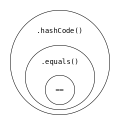

== Object

'''
=== toString
* Java automatically calls toString when an object is printed.
* Some classes implement toString() to return a pretty print, others just print the reference.
** pretty: ArrayList
** reference:  String[]

=== valueOf()
* ``obj == null ? null : obj.toString() ``

{empty} +

==== Equality

===== `==` : reference equality
* variable points to same object
** beware when dealing with objects, e.g. arrays,
** since a new array with same contents will be a new object and thus not ==
** checking for reference equality of two different types -> C-Error

{empty} +

===== `.equals()` : value equality
* object has same properties
** depends on implementation by the object
* `Object.equals()` just uses `==`.
** Same is used in `StringBuilder`, `Array`
* String overrides to check if literal is the same

There is a contract on  how to implement equals:
|===
2+| for x,y,x != null
| x.equals(x) == true | reflexive
| x.equals(y) == y.equals(x) | symmetric
| x.equals(y) && y.equals(z) implies x.equals(z) | transitive
| repeated evaluations should not change the result | consistent
| x.equals(null) = false | (and not a NullPointerException)
|===

{empty} +

==== hashCode
* used for retrieval, e.g. in `HashMap`
* `hashCode()` is a weaker constraint than `equals()`
** `hashCode()` can use a subset of the vars that uses `equals()`

|===
| `a.equals(b) == true` implies `a.hashCode() == a.hashCode()`
| `a.hashCode() != a.hashCode()` implies `a.equals(b) == false`
|===
