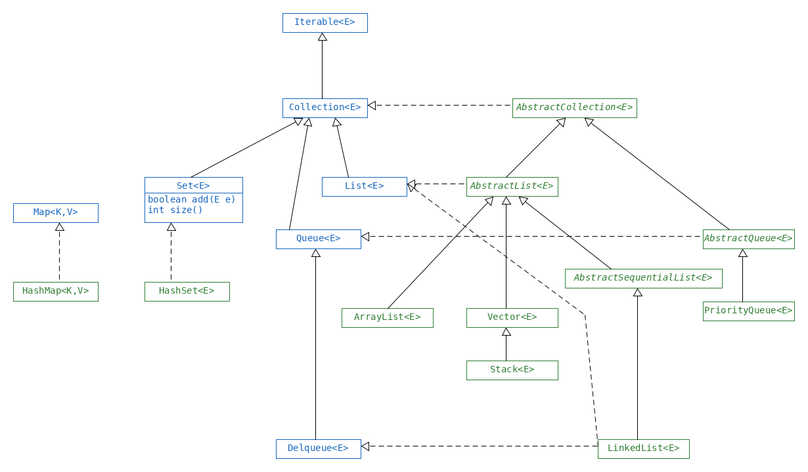

== 055 Collections

* see `basics.collections`
    * for API see `InterfaceCopy` files

==== Array
*  	a fixed-size collection of data of the same type, which can hold zero or more items
* An array is a reference type (even if it is an array of primitives)
* see `about.basics.collections.Arrays`

===== Sorting
* sorts alphabetically  numbers before a before A

        java.util.Arrays;
        Arrays.sort(stringArray);
        [10 , 100, 9]

===== Binary search
* only on sorted arrays , else unpredictable output
* found - return index ou match
* not found - return (negative value of index where searched would need to be inserted) - 1

[source,java]
int[] nym = {2,4,6,8};
Arrays.binarySearch(num,2); // 0
Arrays.binarySearch(num,1); // -1
Arrays.binarySearch(num,3); // -2

===== Comparing
* `int` can be compared with operators (Ch.3)
* Objects e.g. `Integer` can be compared with
    * operators (e.g. `<`,`==`) , this will return a `boolean`.
    * `a.compareTo(b)` , this will return an `int`.
* Arrays can be compared with `Arrays.compare(a,b);` , this will return an `int`.
* Think of `a.compareTo(b)` and `compare(a,b)` as `a - b`.

[source,java]
Arrays.compare({1}, {1}); // 0
Arrays.compare({1}, {1,1}); // -1
Arrays.compare({2}, {1,1}); //

* null is smaller than any other value
* for String : a < b if a prefix of b
* for char / String : a < b if
    * numbers < letters
    * UPPERCASE < lowercaser

when comparing , arrays must be of same type, else compilation error

===== mismatch()
* if arrays same, mismatch() = -1
* else mismatch return index of first index where they differ

===== varargs
main(Strings... args) // varargs , this is legal, args can be used normally

===== N-Dim Arrays
* Array can hold Objects,
* thus can hold Arrays.

==== ArrayList
[source,java]
Arraylist<String> list = new ArrayList<>();
//
var strings = new ArrayList<String>();
strings.add("a");
for (String s: strings) { }
//
var strings = new ArrayList<>(); // assumes var has type List<Object>
strings.add("a");
for (String s: strings) { } // DOES NOT COMPILE
//
Arrays.toString(a2D);
Arrays.deepToString(a2D);

* List is an Interface, so
    * List<String> = new ArrayList<>(); is OK
    * ArrayList<String> = new ArrayList<>(); is OK
    * ArrayList<String> = new List<String>(); is not OK

|===
|`Collection` , `Map` | `int size()`
|`String` | `int length()`
|`Array` | `int length`
|===

* `boolean contains(Object obj) // calls equals() on each element in the list`
    * ArrayList has a own .equals() implememtation
    * [a].equals([b]) true
    * [a,b].equals([b,a]) false

{blank} +

==== Conversions

[options=header]
|===
| `about.basics.collections.Conversions` | toArray() | Arrays.asList() | List.of()
|Types| List -> Array | Array/varargs -> List | Array/varargs -> List
|Collection mutable? | - | NO | NO
|Entries mutable? | YES |  YES | NO
|Sync | NO | YES | -
|===

* `List<String> fixedSizeList = Arrays.asList("a", "b", "c");`
* `List<String> expandableList = new ArrayList<>(fixedSizeList);`

==== Sorting
* `Collections.sort(list)`

==== Sets and Maps
* Sets
    * Are not ordered
    * Can't contain duplicates
    * See `Sets.java`.
* Maps
    * See `Maps.java`.
