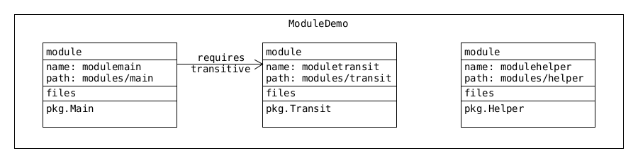

= Modules

* see `deployment.modules`

=== Benefits

|===
| Better Access Control | 
| Clearer Dependency Management | 
| Custom Java Builds | 
| Improved Performance |
| Unique Package Enforcement |
|===

=== Javac Options (?)

* `--modulep-path` , `-p`
** location of module `.jars` i.e. dependencies
* `--module` , `-m`
** `-m <module-name>/<package-name>.<class-name> `
* run
** `java -p deployment/modules -m modulemain/com.main.Main`
* package names must still be unique across all modules
** if both modules contain `pkg` error when compiling.

=== `java` Options
* `--describe-module` 

    
=== `module-info.java`
* `requires transitive foo` : this module depends on `foo` and its dependencies
* also exist:
** `provides` , `uses` , `opens`
     

=== `jdeps`
* looks at module-info.java and code contents
** `jdeps modules/modulemain.jar`
* `-summary -s`
** short version
* when with dependencies to other jars need to specify -m
** `jdeps -m modules modules/modulemain.jar`

=== `jmod` 
* advanced JAR
** create
** extract
** describe
** list
** hash
