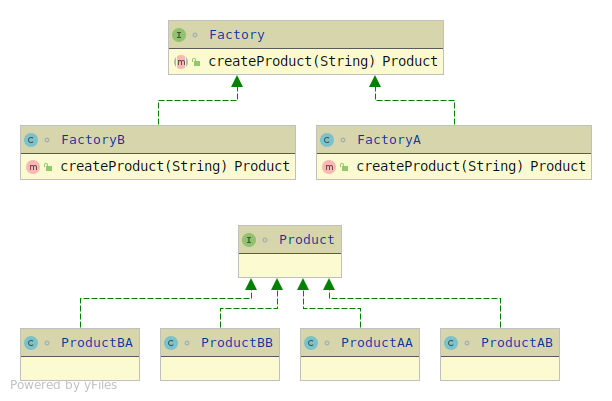

Creational design patterns are all about class instantiation or object creation.
These patterns can be further categorized into Class-creational patterns and object-creational patterns.
While class-creation patterns use inheritance effectively in the instantiation process, object-creation patterns use delegation effectively to get the job done.
* Factory Method
* Abstract Factory
* Builder
* Singleton
* Object Pool
* Prototype.

Use case of creational design pattern-
1) Suppose a developer wants to create a simple DBConnection class to connect to a
database and wants to access the database at multiple locations from code,
generally what developer will do is create an instance of DBConnection class
and use it for doing database operations wherever required.
Which results in creating multiple connections from the database as each instance of
DBConnection class will have a separate connection to the database.
In order to deal with it, we create DBConnection class as a singleton class,
so that only one instance of DBConnection is created and a single connection is established.
Because we can manage DB Connection via one instance so we can control load balance, unnecessary connections, etc.

2)

==== Singleton
* all constructors are private
** this makes class implicitly final - as all constructors contain call to super().
*** thus also constructors of child classes.

==== Immutable Object

1. Use a constructor to set all properties of the object.
2. Mark all of the instance variables private and final.
3. Don’t define any setter methods.
4. Don’t allow referenced mutable objects to be modified or accessed directly.
* i.e. don't return mutable objects (e.g List) via getters
* create a new instance of all the mutable objects passed as param
** otherwise caller might modify his copy,
** thereby modifying the immutable classes copy.
** e.g. `this.foo = new Foo();` instead of `this.foo = foo;`
5. Prevent methods from being overridden.
* either make class final
* or make all methods final
* or make constructor private and use the factory pattern

==== Builder
* to avoid lengthy constructor - i.e. in an immutable object
** make a dummy clone that
*** is mutable
*** contains methods for every constructor param
**** these methods return instance of the dummy object
*** has build() method, that calls constructor of the immutable object to be created

[source,java]
Foo = new FooBuilder.setA("a").setB("b").build();

* Builder is inevitably tightly coupled to the object it builds.

==== Factory
* makes creation flexible
* use a factory class with a method, that returns instances of a product object.
* allows for two degrees of flexibility
** pick which factory creates the product object (abstract factory pattern)
** allow method to further influence what kind of product object is created (factory method pattern)

