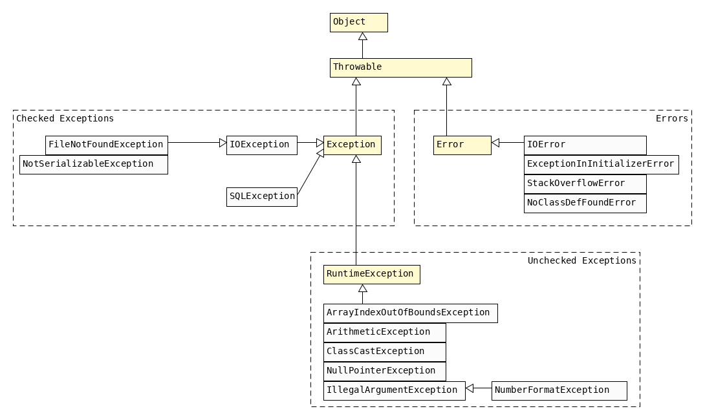

== Exceptions

* Exceptions *do* alter the program flow.
* Since `Throwable` includes `Error` , do not catch `Throwable` directly.
* _handle_ : `try/catch`
* _declare_ : `throw`
* catching `cE` which the try-block is unable to throw -> `C-Error` (unreachable code)
** catching `uE` is always allowed
** catching `Exception` is also ok, because it might be an `uE`
* `Errors` : issues which  should not be handled.

{empty} +

==== try/catch
* try/catch requires all braces to be present
** only `if` and loops allow to omit braces for one-liners.
* scope : var defined in try is only accessible in try.
* there may be multiple catch blocks
** evaluated in the order they appear in
** only one may run
** if superclass Exception catch block appears before subclass catch-block -> `C-Error` (unreachable code)
* order of try/catch/finally matters
* either catch *or* finally must be present.

{empty} +

==== multi-catch-block
* declaring inheritance-related Exceptions in a multi-catch-block -> `C-Error`
** even if child comes before parent.
* multi catch block contains only one `e`
** `(IOException | RuntimeException e)` is the correct syntax
* in normal try/catch it is legal to reassign `e` inside the catch block
** in multi-catch it is *not* - `e` is effectively final here.

{empty} +

==== Kinds of Exceptions
[options=header]
|===
| Type | May be declared | Should be handled | Must be declared/handled
| Unchecked Exception `uE`  | Yes | Yes |
| Checked Exception `cE` | Yes | Yes | Yes
| Error | Yes | |
|===

{empty} +

==== Common Exceptions
[cols="2,4"]
|===
2+| *RuntimeExceptions* `uE`
| `ArithmeticException` | Thrown when code attempts to divide by zero
| `ArrayIndexOutOfBoundsException` | Thrown when code uses an illegal index to access an array
| `java.lang.ArrayStoreException` | Storing wrong data type in an array.
| `java.lang.ClassCastException` | Thrown when an attempt is made to cast an object to a class of which it is not an instance. e.g. `String s; Integer i = (Integer)s;`.
| `java.lang.IllegalArgumentException` | MANUALLY thrown by the programmer with `throw` to indicate that a method has been passed an inappropriate argument
| `java.lang.IllegalStateException` | invalid operation in collections
| `java.lang.NullPointerException` | Thrown when there is a null reference where an object is required
| `java.lang.NumberFormatException` | Subclass of IllegalArgumentException! Thrown when an attempt is made to convert a string to a numeric type but the string doesn’t have an appropriate format. e.g. `Integer.parseInt("ab");`.
| `java.lang.UnsupportedOperationException` | invalid operation in concurrency.
| `java.time.DateTimeException` | Receiving an invalid format string for a date.
| `java.util.MussingResourceException` |  Trying to access a key or resource bundle that does not exist.
2+| *Checked Exceptions*
| `java.text.ParseException` | Converting a String to a number.
| `java.io.IOException` | Parent class for IO-related exceptions - all of whom are checked. +
Thrown when there’s a problem reading or writing a file.
| `java.io.FileNotFoundException` | Thrown when code tries to reference a file that does not exist.
| `java.io.NotSerializableException` |
| `java.sql.SQLException` | Parent class for SQL-related exceptions - all of whom are checked.
2+| *Errors*
| ExceptionInInitializerError | Thrown when a static initializer throws an exception
and doesn’t handle it. +
e.g. `static { int[] a = new int[3];  int i = a[-1];  }`
| StackOverflowError | Thrown when a method calls itself too many times (infinite recursion)
| NoClassDefFoundError |  Thrown when a class that the code uses is available at compile time but not runtime.
|===

{empty} +

==== finally

[source,java]
 int goHome() {
  try {
      // Optionally throw an exception here
      System.out.print("1");
      return -1;
  } catch (Exception e) {
      System.out.print("2");
      return -2;
  } finally {
      System.out.print("3");
      return -3;
  }
 }

* finally is always executed before try/catch return
** thus here return is always -3
** print is either 23 or 13, depending on whether an Exception occurs.
* Special case: finally is not executed

[source,java]
try { System.exit(0); }
finally { System.out.print("Never printed");}

{empty} +
{empty} +

==== try-with-resource
* resources : databases, web servers, filesystems
*  legacy would use `finally` to close the resources
* _try-with-resource_ auto-closes the resource
** as long as implements `AutoClosable` , ie. `.close()`
* implicit finally block is created
** closes the resources in the reverse order they were created
* `catch` block is optional (since finally clause exists implicitly)
** order

1. implicit finally
1. explicit catch
1. explicit finally

* resource varsiables
** do not support compound declaration
** scope of resource is *only* the `try` block.

[source,java]
try (   FileInputStream in = new FileInputStream("foo");
        BufferedWriter out = Files.newBufferedWriter(path2)
){
    //some code
}

{empty} +

==== AutoClosable
`public void close() throws Exception;`

[options=header,cols="2,1,1"]
|===
| | Autoclosable | Closable
|  should implement a subclass of | Exception | IOException
| idempotent - multiple calls return the same result. | should | must
|===

{empty} +

==== Supressed Exceptions

{empty} +

==== Overriding with Exceptions
* this applies only to `cE` - since they _must_ be handled.
* narrower means "child-of" or "more precise"
* Parent method must declare a wider `cE` than the Child method.
* Child may (not must) declare a narrower `cE`

[source,java]
class Parent{ void foo() throws RuntimeException{} }
class Child extends Parent{ void foo() throws Error {} }

{empty} +

==== Creating Custom Exceptions
* extend
** Exception for checked
** RuntimeException for unchecked

* Exception has 3 Constructors

[source,java]
public class SomeException extends Exception {
    public SomeException() {super();}
    public SomeException(Exception e) {super(e);}
    public SomeException(String message) {super(message);}
}
// usage
throw new SomeException();
throw new SomeException(new NullPointerException());
throw new SomeException("hello");

* Java automatically prints the stacktrace when handling an exception.
* to print stacktrace manually use `e.printStackTrace();`
