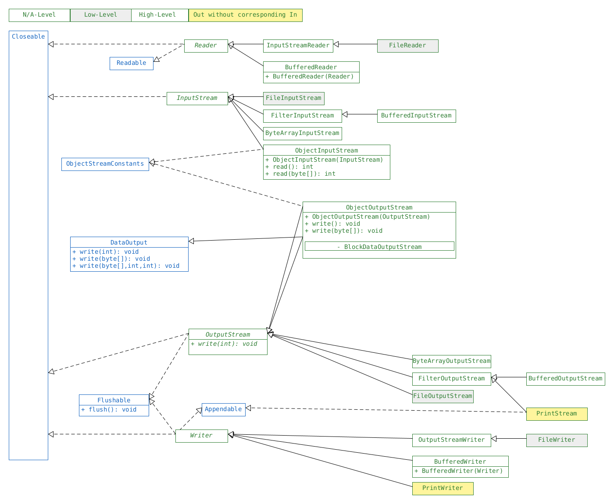

== IO-Streams

* `File` represents a pathname.
* absolute path = path to working dir + separator + relative path
** Java auto inserts the separator in most operatoins.
* get system specific separator
** `System.getProperty("file.separator")`
** `java.io.File.separator`

{empty} +

==== IO Streams
* access contents of a file one slice at a time.
** reduces memory usage on larger files.
* slice size depends on implementation : may be byte, char, String or group thereof.
* IO Streams are also used in transferring messages over network.
* Stream | binary/byte data
** Named `InputStream`/`OutputStream`
* Reader/Writer | char/String data
** convenience classes
* `PrintStream` has no corresponding `InputStream` class.
* *low-level-streams*
** read underlying data
** e.g. FileInputStream, FileReader
* *hight-level-stream*
** wrap low-level-stream
** add methods e.g. `readLine()`
** add performance enhancements
** e.g. BufferedReader
** can wrap other high-levels-streams
*** e.g. FileInputStream -> BufferedInputStream -> ObjectInputStream
**** read -> performance -> filter as Objects
* things named Buffered read/write in groups of slices -> perf for seq FS.

[%header, cols="2,3"]
|===
| High-Level Class | Purpose
| `BufferedReader` / `Writer` | Add buffering to existing `Reader` / `Writer`.
| `Object` `Input` / `Output` `Stream` | De-/serialize from/to binary stream.

| InputStreamReader/OutputStreamWriter | Read/write text stream from/to binary stream.
| PrintStream / PrintWriter | Write formatted representations of Java objects to binary / text stream
|===

==== Operations
* `Flushable.flush()`
** OS might cache write, `.flush()` forces it to write to disk
*** might be expensive (might also be better when used in regular intervals -> load balancing)
*** auto. called in `.close()`

* `mark(int i)` can be used to `reset()` io-steam to marked slice, if `.markSupported`
** if not supported will throw `IOException`
** `i` indicates the max distance between mark and reset to buffer (this is done in memory)
*** if distance greater an Exception may be thrown (depends on implementation)

* `skip(long i): long
** returns how many slices were actually skipped
** similar to read, however faster if amount large

[source,java]
InputStream is; // AB
System.out.print ((char)is.read());
if(is.markSupported()) {
is.mark(100);
System.out.print((char)is.read());
is.reset();
}
System.out.print((char)is.read());

=== Usage

==== Stream
* InputStream/OutputStream
* `read(): int`
** returns read value, returns -1 if  no value can be read

* `read(byte[])` : read to a previously initialized `byte[]`
** see `IODemo.DemoByteArrayStream`

* `write(byte[] buffer): void`
*** write to a previously initialized byte[]
* `write(byte[] buffer, int start, int amountToRead): void`
** usage:
[source,java]
byte[] buffer = new byte[1024];
int bytesRead = in.read(buffer);
int offset = 0; // may be any value, usually 0
out.write(buffer, offset, bytesRead - offset);

{empty} +

==== BufferedStream
* does not actually add any new methods, just overwrites with better buffering.

{empty} +

==== Reader / Writer
* see `IODemo.DemoBufferedFileRW`
* read char not byte
** as char can be mapped to int
** read() can still return -1
* File Writer inherits wirte(String) from writer
* Reader can be wrapped in BufferedReader to have readLine()

==== Charsets
* are handled by Reader/Writer auto. , however:
[source,java]
Charset usAsciiCharset = Charset.forName("US-ASCII");
Charset utf8Charset = Charset.forName("UTF-8");
Charset utf16Charset = Charset.forName("UTF-16");

