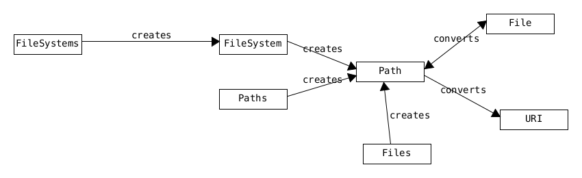

=== NIO.2
Differences to java.io streams.

* buffers / channels instead of streams
* load date from file channel into temp buffer, that
** unlike streams, can be read forward and backward without blocking the underlying resource
* NIO.1 was not popular

==== Path
vs File

* `File` is a class
* Path is an interface
** implementation may depend on System.
** replacement for legacy class `java.io.File`
**  supports symbolic links (unlike File ).
*** pointer to another file/directory.

* Paths : factory for Path
* Ther are also varioius helper classes like `Files`
* difference:
** factory crates
** helpers operate on / transform

==== Paths
* see `NIODemo`
* has `.toURI(): URI`

==== URI
* String that identifies a resource
* schema followed by *absolute* path
* schemas:
** file://
** http://
** https://
** ftp://

=== FileSystem
* Path.getPath() alias to FileSystem.getPath()
* FileSystems.getDefault(): FileSystem
* FileSystems.getFileSystem(URI): FileSystem

* Path has toFile()
* File has toPath()

=== Methods
* some methods require the Path to "exist", and will throw PathExceptoin if not existent

* `Path.getNameCount(): int`
* `Path.getName(int): Path`
* `Path.getFileName(): Path`
* `Path.getParent(): Path`
** will not traverse outside of working dir
** i.e. parent of root, working dir, root of relative path
** will return `null`
* `Path.getRoot(): Path`
** root or null if path relative

==== Path Symbols
* . current dir
* .. parent dir

* relativize() and resolve() do not resolve path symbols 

=== Views
* Fetch metadata from a batch of files.
