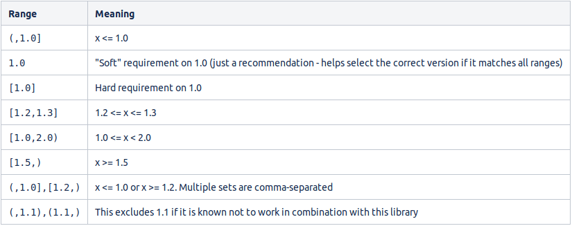

= Maven
:toc:
:toclevels:4

==== Add Spring Resources
[source]
<project>
<build>
<resources>
      <resource>
          <directory>src/main/resources</directory>
      </resource>
</resources>

|===
| POM   | Project Object Model
| -X    | debug
| clean | delete previously generated stuff
| -U    | force update
|===

[source]
<dependency>
    <groupId>com.atlassian.jira</groupId>       # group = project group
    <artifactId>jira-core</artifactId>          # artifact = project
    <version>${jira.version}</version>          # version of artifact
    <scope>provided</scope>                     # see maven-scope.txt
</dependency>

{empty} +

=== Quick Fixes

|===
| set mvn java version | `export JAVA_HOME=/usr/lib/jvm/<jdk>`
|===

=== Scopes

===== compile

* default scope, used if none is specified.
* Compile dependencies are available in all classpaths of a project.
Furthermore, those dependencies are propagated to dependent projects.

===== provided

This is much like compile, but indicates you expect the JDK or a container to provide the dependency at runtime.
For example, when building a web application for the Java Enterprise Edition, you would set the dependency on the Servlet API and related Java EE APIs to scope provided because the web container provides those classes.
This scope is only available on the compilation and test classpath, and is not transitive.

===== runtime

This scope indicates that the dependency is not required for compilation, but is for execution.
It is in the runtime and test classpaths, but not the compile classpath.

===== test

This scope indicates that the dependency is not required for normal use of the application, and is only available for the test compilation and execution phases.

===== system

This scope is similar to provided except that you have to provide the JAR which contains it explicitly.
The artifact is always available and is not looked up in a repository.

===== import

This scope is only used on a dependency of type pom in the section.
It indicates that the specified POM should be replaced with the dependencies in that POM's section.
Since they are replaced, dependencies with a scope of import do not actually participate in limiting the transitivity of a dependency.

=== Version Syntax

=== Commands

==== Update Dependencies

* not sure if this works
* the idea would be to do the minimum, while calling for update
* `mvn validate -U`

==== Run Project

[source]
<properties>
        <exec.mainClass>fully-qualified-class-name</exec.mainClass>
</properties>
mvn clean compile exec:java

