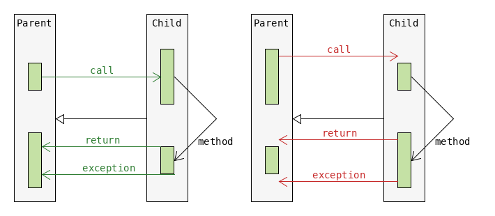

== Methods and Encapsulation
{empty} +

'''

==== Signature
* _signature of a method_ = method name and parameter list (type and order).
** the name itself is not unique.

{empty} +

'''

==== Varargs
* Varargs : e.g. `int...`
* similar to `int[]` for array
* may additionally take `1,2`
* only one `...` allowed per paramter list
* may only be used with the last prameter in parameter list.
* a method with a `int[]` parameter won't accept `1,2`
* must have an `int...` parameter to accept `1,2`

[source,java]
void foo(int... x) { }
foo(new int[2]);
foo(new int[]{1, 2});
foo(1, 2);
foo(); // creates new int[0]

{empty} +

'''

==== Passing Data
[source,java]
{
    int i=0;
    foo(i);
}
void foo(int j){j=1;}

* Java is "pass-by-value"
** the parameter is created as a new local variable
** the parameter `j` holds the  same value as the original variable `i`
* with mutable _values_
** modifying the parameter will cause a modification of the original variable
** mutable reference type (`StringBuilder`,`List`)
* with immutable values this is not a problem
** primitive type (`int`)
** immutable referene type (`Integer`)
* "pass-by-value" also happens on `return`.
* "pass-by-reference"
** the physical address of the __variable__ is passed
** `j` would point to the same physical address as `i`

{empty} +

'''

=== Overloading
* _method name_ must stay the same.
* _parameter list_ must change.
** changing `int[]` to `int...` (varargs) does not count, -> `C-Error`.
* other parts of the declaration are irrelevant
** only changing `return` type or `static` modifier -> `C-Error`
* Generics
** Due to _type erasure_ can't overload `foo(List<String> a)` with `foo(List<Integer> a)` -> `C-Error`.
* Arrays  - don't have _type erasure_.
** `foo(String[] a)` overloads `foo(Integer[] a)`.

==== Order when Overloading
. Exact match by type (primitive or reference).
. Cast to superclass type.
. Convert to larger primitive type.
. Autobox or unbox.
. Varargs

When a transformation takes palce, goto 1, e.g.: +
int -> Integer -> Number -> Object +
int -> long

==== Errors when Overloading
[source,java]
void play(Long a){}
play(4L); // OK , autobox long -> Long
play(4); // C-Error , autobox int -> Integer is OK.
// Can't cast between children (Integer, Long) of parent (Number).
void play(Object a){}
play(4); // OK can autobox from int to Integer
void play (long a){}
play(4); // OK can convert from int to long

{empty} +

'''

=== Overriding

[options=header]
|===
| | Child method must have ...
| > Prerequisite |
> the same signature as parent method
| `Parent child = new Child();` +
Leads to the possibility of a `Child` object +
being referenced by a reference of type `Parent`. +
To avoid  errors, the following checks are made at compilation.  |
>  a _wider_ access modifier +
>  a _covariant_ return type +
>  _covariant_ exceptions
|===

===== Covariance
* Same class or subclass.
* `void` is only covariant with `void`

{empty} +

===== Static & Instance
* `static` methods can't be overridden with `instance` methods and vice versa.
** If _signature_ _differs_ `static` and `instance` methods wit same _name_ may coexist.
*** However this blocks one overload each.
* `static` methods are hidden, not overridden.

{empty} +

==== Overriding with Generics
* Type erasure : `List<T>` will be converted to `List<Object>` during compilation.
** thus can't overload `foo(List<Integer>)` with `foo(List<String>)`
* thus overriding `foo(List<Integer>)` with `foo(List<String>)` would be seen as an illegal overload
* instead it's ok to override `foo(List<Integer>)` with `foo(List<Integer>)`
* `Parent.foo(List<Integer>)` with `Child.foo(ArrayList<Integer>)` will cause an OK overload.
* for 816
** wildcard for generics is `<?>`
*** `<? super String>` and `<? extends String>` is ok too
* generic return types
** generic must be exactly same
** return type of overriding method may be coviant
***  Parent `List<String> foo()` Child `ArrayList<String> foo()`
* final methods
** can't be overridden or hidden
** still could be redeclared (if private in parent)
* special
** Parent : `pubic int i=0;`
** Child : `private int i=3;`
** 3 reference paths : new Parent(), new Child(), Parent childAsParent = new Child())
** we are executing main from child
** parent.i == 0
** child.i ==3 // thus hiding works
** childAsParent == 0 // hiding still works // just __beware__ accessing private from outside of class
