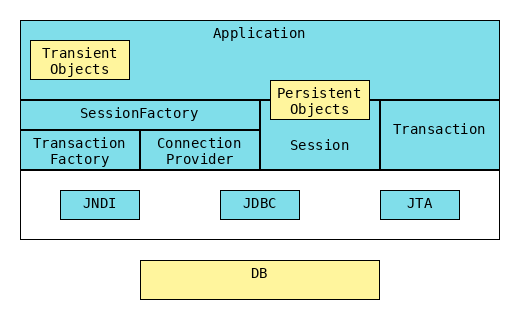

== JPA (Java Persistence API)
** is a spec

=== Hibernate
* Is an implementation of JPA
** Thus for documentation of what the interfaces are
supposed to do, read the JPA javadoc.

[cols="1,4"]
|===
| SessionFactory |an immutable thread-safe cache of compiled mappings for a single database +
> source of Session(s)
| Session | > represents a conversation between the application and the DB +
_ > single-threaded, short-lived object  +
> wraps java.sql.Connection +
> factory for Transaction
| Persistent object | short-lived, single threaded objects that contains persistent state and business function. +
These can be ordinary JavaBeans/POJOs. +
They are associated with exactly one
| Transient objects | objects that are not currently associated with a `Session`. +
> may have been instantiated by the application and not yet persisted, +
> may have been instantiated by a closed `Session`.
| Transaction | > single-threaded, short-lived object used by the application to specify atomic units of work. +
> abstracts the underlying JDBC or JTA transaction. +
> a `Session` might span multiple `Transaction`(s).
| ConnectionProvider | > factory for JDBC connections. +
> abstracts the underlying javax.sql.DataSource or java.sql.DriverManager. +
> is not exposed to application, but can be extended by the developer.
| TransationFactory | > factory for Transaction
|===

==== Annotations
[cols="1,4"]
|===
| @Basic | for basic columns, such as String.
| @Transient |
|===

{empty} +

=== ORM (Object-relational mapping)

is the programming technique to map application domain model objects to the relational database tables. +
Hibernate is java based ORM tool that provides framework for mapping application domain objects to the relational database tables and vice versa.

{empty} +

=== JTA (Java Transaction API)
