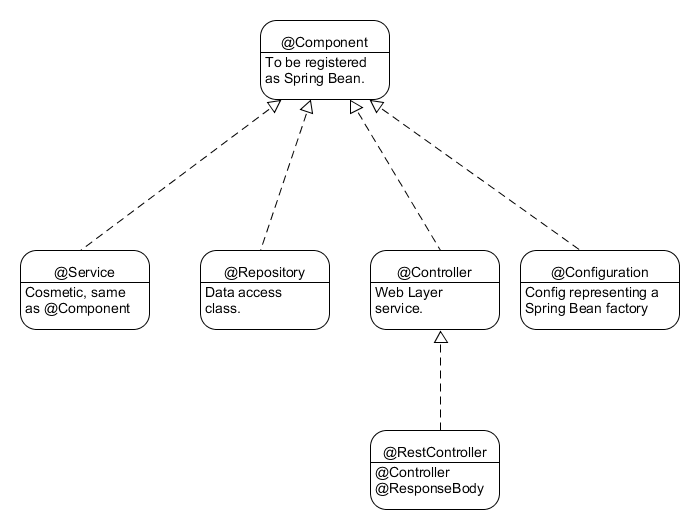

= Annotations
:toc:

== About
* Meta-Annotations : annotations that are used on other annotations.
** if an 🔖 has `@Target(ElementType.TYPE)`, it can accept other 🔖
* Some core annotations are shown in the following diagram, others are listed below.

{empty} +

[cols="4,1,1,1,1,12"]
|===
| Annotation 4+| Class/Field/Method/Param | Comment

6+| **A**
| `@AliasFor` | | | | | Used to make one field an alias of another (why? TODO)
| `@Autowired` | | | | | Automatic injection of ☕s, instead of using XML-config. +
Used with `@Qualifier`.
6+| **B**
| `@Bean` | | | | | indicates that method returns a  🌱☕. See `SpringBeans.adoc`.
| `` | | | | |
| `` | | | | |
6+| **C**
| `@Component` | ✔️ ️| | | | registers class for scanning.
| `@ComponentScan` | | | | | > requires `@Configuration` +
> enables component scanning (`@Autowire` etc.) +
> designate base directory for component scanning.
Here we can specify the base packages to scan for spring components.
| `@Configuration` | ✔️ | | | | extends `@Component` +
> processed by 🌱 to generate ☕ definitions. +
> usually used with `@Bean` methods, `@ComponentScan`, `@PropertySource`.
| `@ConfigurationProperties` | | | | | TODO
| `@Conditional` | ✔️ | | ✔️ | | on `@Configuration` or on `@Bean`
| `@Controller` | ✔️ | | | | extends `@Component`, adds MVC features: +
> web-layer exception-handling +
> handler mapping +
> is +
`@Target(value=TYPE)` +
`@Retention(value=RUNTIME)` +
`@Documented` +
`@Component`
| `@ControllerAdvice` |✔️| | | | designates class, to globally handle exceptions for `@Controller`
6+| **D**
| `@DataJpaTest` | | | | |
6+| **E**
| `@BeanFactoryPostProcessor` | | | | | see `SpringBeans.adoc`
| `@BeanPostProcessor` | | | | | see `SpringBeans.adoc`
| `@EnableAutoConfiguration` | ✔️ | | | | enables 👢 to conf ☕ based on dependencies available on class-path +
> exclude?={SomeObj.class} +
> excludeName?={SomeObj}
| `@EnableConfigurationProperties` | | | | | enables `@ConfigurationProperties`
| `@EnableJpaRepositories` | | | | | allows `@Repository`
| `@EnableTransactionManagement` | | | | | Indicates config for `tm` -> `ds` -> `db`
| `@EnableWebMvc` | ✔️ | | | | enables MVC Java config +
> requires `@Configuration`

| `@Entity` | | | | | JPA annotation to make this object ready for storage in a JPA-based data store.
| `` | | | | |
6+| **I**
| `@Inject` | | | | |
| `@InitBinder` | | | | |
6+| **M**
| `@ModelAttribute` | | | | |
6+| **N**
| `@Named` | | | | |
6+| **P**
| `@PathVariable` | | | | | Used to indicate type of parameter in method REST-endpoint. See `@RequestParameter`.
| `@PostConstruct` | | | | | alternative way for bean initMethod +
It can be used when the bean class is defined by us
| `@PreDestroy` | | | | | alternative way for bean destroyMethod +
It can be used when the bean class is defined by us
| `@PropertySource` | | | | | > requires `@Configuration` +
provides a simple declarative mechanism for adding a property source to Spring’s Environment. +
There is a similar annotation for adding an array of property source files i.e `@PropertySources`.
| `@Profile` | | | | | An app can be run with different profiles. Profiles are sets of parameters.
6+| **S**
| `@Service` | ✔️ | | | | see diagram
| `@SessionAttributes` | | | | |
| `@SpringBootApplication` | ✔️ |   |   |   | `@Configuration` +
`@EnableAutoConfiguration` +
`@ComponentScan` +
| `@SpringBootTest` |  | | | |
6+| **R**
| `@Repository` | ✔️ | | | | see diagram
| `@RestController` | ✔️ |   |   |   | `@Controller` + `@ResponseBody`
| `@RequestMapping` |   |   | ✔️ |  ️ | For URL/method (e.g. GET) in `@Controller`
| `@Resource`       |   |   |   |   |
| `@ResponseBody`   | ✔️ |   |   |   | Auto-map return data into response body -> skip template.
| `@Required`       |   |   | ✔️ |   | legacy, applies to setter inside bean +
indicated the value must be provided via xml at config-time.
| `@RequestParam`   |   |   |   | ✔️ | For `/?foo=bar` in `@Controller` +
See `@PathVariable`.
| `@RequestHeader`  |   |   |   |   |
6+| **T**
| `@Transactional`  |   |   |   |   | Specify transactional (JPA) behaviour of Bean.
6+| **V**
| `@Value`  |   |   |   |   | Inject value from `.properties`. See `./properties/`.
6+| **W**
| `@WebMvcTest`  |   |   |   |   | Test ony MVC components
6+| **Q**
| `@Qualifier`  |   | ✔️ |   |   | wire only one bean out of several candidates
| `@Query` | | | | |
|===
