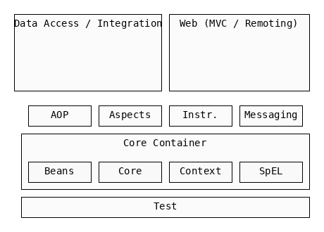

= Spring
:toc:
:toclevels: 6

{empty} +

==== Spring Container
The Spring Container manages the lifecycle of Spring Beans.

* see `Spring Bean Life Cycle`

image:img/spring-container.png[]

* uses IoC / DI
* 2 main container types:
** `ApplicationContext` `extends` `BeanFactory`

{empty} +

==== Architecture

* Core
    ** Core
    ** Bean
    ** Context
    ** SpeL : expression language for manipulating object graph at runtime
* Data Access/Integration
    ** JDBC :
    ** ORM : integrates object-relational-mapping (JPA/JDO/Hibernate)
    ** OXM : supports object-xml-mapping (JAXB, Castor, XMLBeans)
    ** JMS :
    ** Transactions :
* Web
* Miscellaneous

{empty} +

==== Spring Bean Life Cycle

image:img/bean-life.png[]

==== JpaRepository
* is-a Repository with JPA
* is-a Component with DAO

==== IoCC (IoC Container)
* IoCC
** is responsible for injecting the dependency.
** is responsible to instantiate, configure and assemble the objects.
*** to instantiate the application class
*** to configure the object
*** to assemble the dependencies between the objects

==== Dependency Injection (DI)
* See `design/decoupling/levels/Levels.adoc` for an overview.
* DI is the opposite of _dependency lookup_
** resource is retrieved after demand
** `A obj = new AImpl();`
** `A obj = A.getA(); // using factory`
** tight coupling
** complicates testing
* Spring supports
** Constructor injection
** Method injection (by setter)

{empty} +

==== Hypertext Application Language (HAL)
HAL is a simple format that gives a consistent and easy way to hyperlink between resources in your API.

Adopting HAL will make your API explorable, and its documentation easily discoverable from within the API itself.
In short, it will make your API easier to work with and therefore more attractive to client developers.

APIs that adopt HAL can be easily served and consumed using open source libraries available for most major programming languages.
It's also simple enough that you can just deal with it as you would any other JSON.

http://stateless.co/hal_specification.html

{empty} +

==== CORS : cross-origin resource sharing
s a mechanism that allows restricted resources on a web page
to be requested from another domain outside the domain from which the first resource was served

{empty} +

==== Context -> Spring Bean
* ApplicationContext is an interface
* Some ApplicationContextImpl is used to provide _context_.
* context provides Spring Beans

{empty} +

==== Spring Bean
* Spring Bean any object initialized through Spring container.

===== 5 Bean Scopes
* singleton
** Only one instance of the bean will be created for each container. This is the default scope for the spring beans. While using this scope, make sure bean doesn’t have shared instance variables otherwise it might lead to data inconsistency issues.
* prototype – A new instance will be created every time the bean is requested.
* request – This is same as prototype scope, however it’s meant to be used for web applications. A new instance of the bean will be created for each HTTP request.
* session – A new bean will be created for each HTTP session by the container.
* global-session – This is used to create global session beans for Portlet applications

===== 3 Bean Configuration Paths
* Annotation : `@Service` , `@Component`, `@Scope`.
* XML : `resources/foo.xml`
* Java (Spring 3.0+) : `@Configuration`, `@ComponentScan`, `@Bean`.

