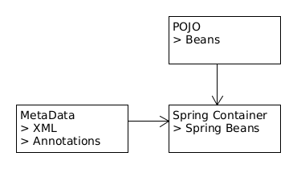

= Beans
:toc:

{empty} +

===== Spring Bean

* any obj init through 🌱 container.

{empty} +

===== `@Bean`

Indicates that a method produces a bean to be managed by the Spring container. +
@Bean annotation also can be used with parameters like name, initMethod and destroyMethod.

* name – allows you give name for bean
* initMethod – allows you to choose method which will be invoked on context register
* destroyMethod – allows you to choose method which will be invoked on context shutdown
{empty} +

===== Spring Container

* 🌱 container manages the lifecycle of 🌱☕s.
* uses IoC / DI
* 2 main container types:
** `ApplicationContext` `extends` `BeanFactory`

{empty} +

===== 5 Bean Scopes

[cols="1,4"]
|===
| singleton | > one instance per container +
> default scope
| prototype | new instance each time bean is requested
| request | (~prototype) new instance for each HTTP session.
| global-session | for portlet apps
|===

{empty} +

===== Initialization

* eager (on startup)
** singleton, portlet(?)
* lazy (on demand)
** singleton (@Lazy), all others

{empty} +

===== 3 Bean Configuration Paths

* XML : `resources/foo.xml`
* Annotation : `@Service` , `@Component`, `@Scope`.
* Java (Spring 3.0+) : `@Configuration`, `@ComponentScan`, `@Bean`.

{empty} +

===== Spring Bean Life Cycle

image:img/bean-life.png[]

{empty} +

===== IoCC (IoC Container)

* is responsible for injecting the dependency.
* is responsible to instantiate, configure and assemble the objects.
** to instantiate the application class
** to configure the object
** to assemble the dependencies between the objects

{empty} +

===== Dependency Injection (DI)

* See `design/decoupling/levels/Levels.adoc` for an overview.
* DI is the opposite of _dependency lookup_
** resource is retrieved after demand
** `A obj = new AImpl();`
** `A obj = A.getA(); // using factory`
** tight coupling
** complicates testing
* 🌱 supports
** Constructor injection
** Method injection (by setter)

{empty} +

===== Post Processors

* `@BeanFactoryPostProcessor` called:
** after bean definitions have been loaded
** before any bean has been initialized
** allows customizing beans, even eager-initializing ones
* `@BeanPostProcessor` called:
** after each bean has been initialized
** thus
*** during startup for singleton beans
*** on demand for prototype beans
