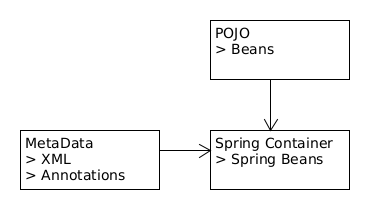

= Beans 1 : Bean
:toc:
:toclevels: 5

=== Spring Bean

* any object init through 📦.
* `@Bean`
- Indicates that a method produces a bean to be managed by 📦. +
- attributes:
** `autowireCandidate` : skip
** initMethod – allows you to choose method which will be invoked on context register
** destroyMethod – allows you to choose method which will be invoked on context shutdown
** name – allows you give name for bean
** value : alias for name
* ☕ ID is not an attribute -> auto by spring -> class name with first letter lower case

{empty} +
