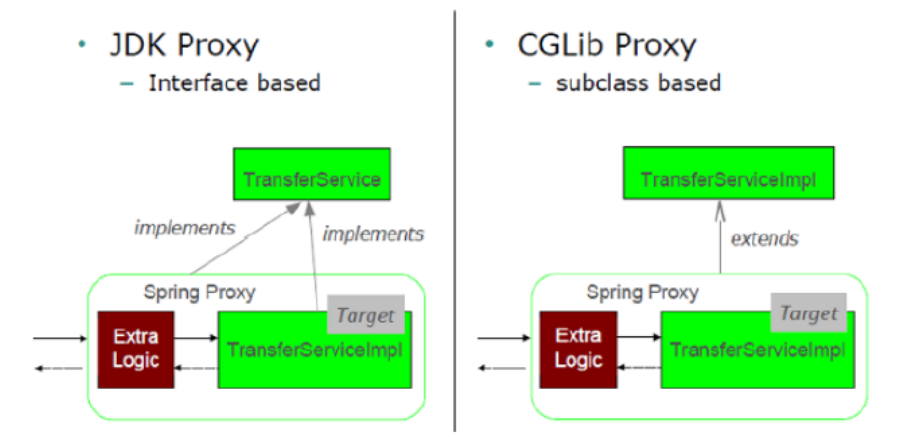

= Dependency Injection
:toc:
:toclevels: 5

{empty} +

=== 3 Types of DI

* CDI (Constructor)
* SDI (Setter)
* FDI (Field, since 2.5 ~ `@Autowired`)

{empty} +

=== Ways to configure DI

* XML
** `beans.xml` -> `ParentBean`
*** CDI POJO
*** SDI method name pattern
* Java
** `@Configuration` -> `@Bean` +
`AppConfig` -> `ParentBean`
*** CDI POJO
*** SDI POJO
* Annotation
** `@Configuration` : this is config
** `@ComponentScan(path)` : where to scan for components
** `@Component` : this is component
** `@Autowired` : inject this, used on
*** CDI `@Autowired`
*** SDI `@Autowired`
*** FDI `@Autowired`

{empty} +

==== @Bean vs @Component

`@Bean` applies to methods, when using Java config. +
`@Component` applies to classes, when using 🔖 config.

* `@Bean` outside of `@Configuration` causes _lite mode_.
** calls to the `@Bean` method will not be itercepted by the CGLib proxy.

{empty} +

=== @Import

* Import other `@Configuration`

=== @Qualifier

* used with @Autowire to distinguish bean instances of same type.
* differes based on 'way'
** B : 'qualifier' matches `@Bean qualifier()`
** C : 'qualifier' matches `@Component("qualifier")`
* can write own custome 'qualifiers' (skip due to scope, see https://www.baeldung.com/spring-autowire)

{empty} +

=== Trivia

* Annotation DI was added in Spring 2.5
* Annotation DI happens before XML, thus overriden if overlapping.

==== CDI vs SDI

* SDI can:
** skip injections
*** could be done with assigning `null` in CDI, +
but that is obviously not the intended use.
** swap injected bean without new instance of host bean
* overall logic applies:
** if always provided and bound to instance -> CDI
** if optional or swappable -> SDI

==== `@Autowired`

* If the type that is autowired is an `[]` or `Collection`, then the Spring container will collect all beans matching the value-type of the array in an array and inject the array.
* If type is `Map<String,Foo>`, spring will collect all and set Bean name as Key.
* can have any access modifier (incl.`private`)
* CDI `@Autowired` is only required if injected ☕ has multiple constructor.
* attributes:
- required : boolean (default: true )
** guess that thus all constructor params that are autowired are required
** this matches semantics where cdi obj are expected to be provided

==== Proxy

* used to:
** intercept calls to bean to inject AOP advice
* JDK proxy
** part of JDK (aka. dynamic proxy)
** requires `iface` (`iface` based)

* CGLib Proxy
** used by spring via CGLib lib
** included in spring-core (since 3.2)
** subclass based (proxied class must not be final / have final methods)
* neiter intercepts self-invocations
** `obj.foo(){ obj.bar(); }`
* multiple layers of proxies may be used, beware complexity.

==== Java vs XML Config

* Java
** Config can be split into multiple `@Configuration` classes.
** Easier interaction with JUnit/Mockito
** Config classes must not be final (CGLib proxy)
* XML
** IDE may need plugin to validate XML configs
