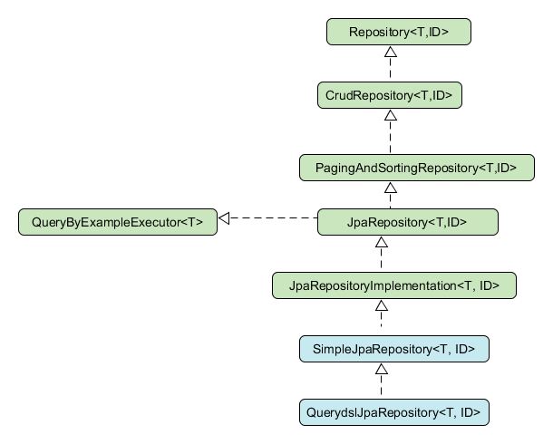
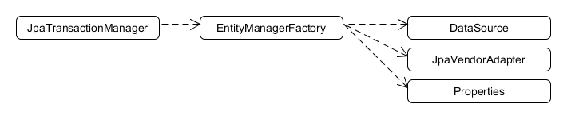

= Spring JPA
:toc:
:toclevels: 5

=== About

* see `about-java/persistence/JPA`

=== Trivia

* if non-Boot : must set up `EntityManager`

=== Repo Hierarchy

{empty} +

=== Dependencies

* When creating a `tm`, the following objects are required.
* TODO unify with `about-java/persistence/JPA`

