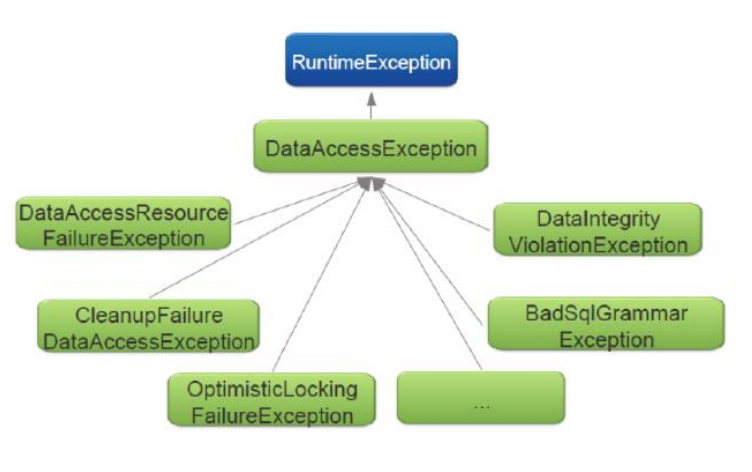

= Spring JPA
:toc:
:toclevels: 5

=== About

* see `about-java/persistence/JPA`

=== Trivia

* if non-Boot : must set up `EntityManager`

=== Repo Hierarchy

image:img/spring-jpa.png[]

{empty} +

=== Dependencies

* When creating a `tm`, the following objects are required.
* TODO unify with `about-java/persistence/JPA`

image:img/spring-jpa-dependencies.png[]

==== Exceptions

* Spring favors `uE` for simplicity.
* all of the below `E` are `uE` :

==== `DataSource` s

* `DriverManagerDataSource` : new connection for every request
* `SimpleDriverDataSource` : like `DriverManagerDataSource` but works with JDBC directly.
* `SingleConnectionDataSource` : same connection for every request, but is ot a pooled data source.
* `EmbeddedDatabase` via `new EmbeddedDatabaseBuilder().build()`
** mostly for _dev_ and _test_.

==== JdbcTemplate

* makes use of some callbacks:
** `RowMapper` (see demo)
** `RowCallbackHandler` (TODO)
** `ResultSetExtractor`
* methods
** batchUpdate
** execute
** query
** queryForList
** queryForMap
** queryForObject
** queryForRowSet
** update
* new conn for every method called (avoids hogging)

==== Transactions

* _local_ on a single resource (db, msg que)
* _global_ over multiple resources
** e.g. if resource B fails to persist, resource A roll back as well
** requires custom transaction manager

===== TX Trivia

* method with `@Transactional` must be public
* must `@EnableAspectJAutoProxy(proxyTargetClass = true)` unless you want to specify `ifaces`.
* calling @Transactoinal of same obj, bypasses proxy
** thus, the called method will execut within the same TX ctx
* recommend to put `@Transactional` on concrete classes/methods as this will work with both proxy types.
* must wrap DataSource in TransactionAwareDataSourceProxy to use @Transactional

===== TX Isolation Levels

* in regard to other TX
* characteristics
** dirty read : TX1 reads uncommited data from TX2
** non-repeatable read: TX1 reads data, which TX2 is about to modify
** phantom read: same query returns different data

* locks are usually held till end of TX
** range 🔒 : on select where

[cols="4,1,1,1,1,1,1"]
|===
| Level | DR | NRR | PR | read 🔒 | write 🔒 | range 🔒

| 8 Serializable        |   |   |   | ✔️ | ✔️ |  ✔️
| 4 Repeatable Read     |   |   | ✔️ | ✔️ | ✔️ |
| 2 Read Committed      |   | ✔️ | ✔️ |   | ✔️ |
| 1 Read Uncommitted    | ✔️ | ✔️ | ✔️ |   |   |
| -1 Default            |   |   |   |   |   |
|===

===== TX Propagation

[cols="1,4"]
|===
| mandatory | There must be an existing TX when the method is invoked, or an E will be thrown
| nested | Executes in a nested transaction if a transaction exists, otherwise a new
transaction will be created. This transaction propagation mode is not implemented in
all transaction managers
| never | Method is executed outside of a transaction. Throws exception if a transaction
exist
| not_supported | Method is executed outside of a transaction. Suspends any
existing transaction
| required (default) |  Method will be executed in the current transaction. If no
transaction exists, one will be created
| requires_new |  Creates a new transaction in which the method will be executed.
Suspends any existing transactio
| supports | Method will be executed in the current transaction, if one exists, or outside
of a transaction if one does not exist
|===

==== JDBC AutoCommit

* commits after every query
* makes it to have multiple queries (unit of work) within a TX
* `setAuttoCommit(false)` to disable

==== Rollabck Policy

* default on Unchecked E / Errors
* `@Transactional(rollbackFor="", noRollbackFor="")`

==== ORM
* think Hibernate
* pros
** decent abstraction, less boilderplate, unified api
** cache
* cons
** slow, added hidden complexity

==== Cache
* cache : copy of data outside of the db
* flushing : writing cache back to db
* PersistenceContext ~ cache
** has it's own non-shared db conn
* EntityManager
** represents PC
** API for managing pc / interacting with entities
