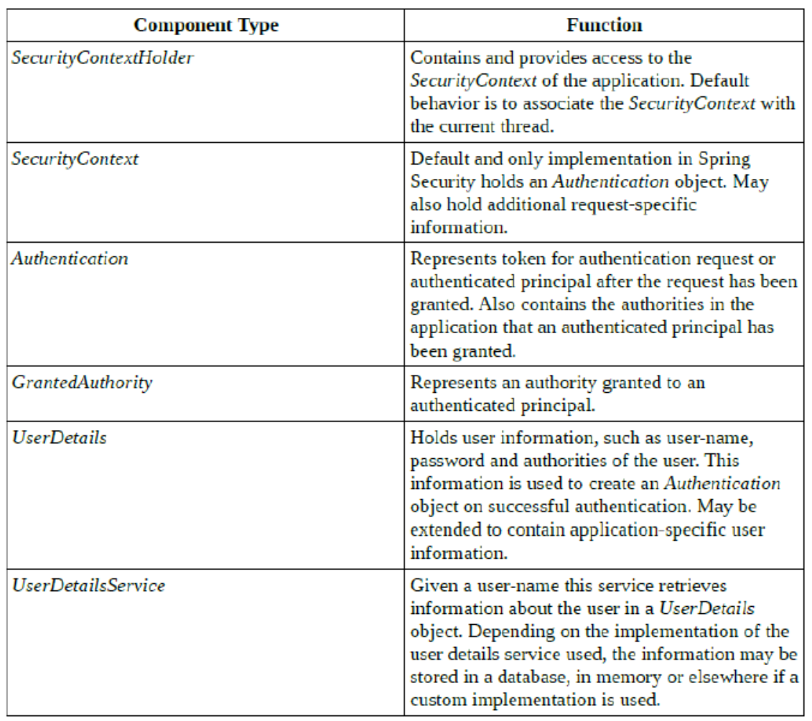
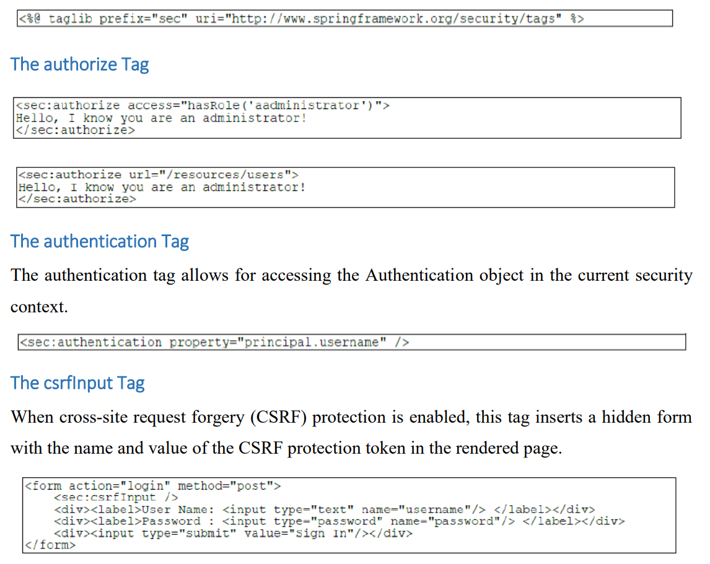

= Security
:toc:
:toclevels: 5

{empty} +

=== Overview

=== Authen Steps

* user:pwd combined into `UsernamePasswordAuthenticationToken` impl `Authentication`
* token passed to impl `AuthenticationManager`
** returns populated `auth` impl `Authentication`
* secu-context established by
`SecurityContextHolder.getContext().setAuthentication(auth)`

=== Authorization

* Authenticated _principal_ is assigned 1..n authorities (roles).
* Requests to resources are bound to roles.

=== Implementation

image:img/spring-secu-overview.png[]

* DelegatingFilterProxy is config, delegates to FilterChainProxy
* FilterChainProxy takes 1..n SecurityFilterChain as constructor param.
* SecurityFilterChain associates URL pattern with a list of filters.

==== DelegatingFilterProxy

* impl `Filter`
** `void doFilter() { ctx.getBean().doFilter() }`

===== SecurityFilterChain

* iface
* `DefaultSecurityFilterChain` impl `SecurityFilterChain`
* constructor of `DefaultSecurityFilterChain` params:
- request matcher
- ChannelProcessingFilter (2..n are optional but ordered) SecurityContextPersistenceFilter
- ConcurrentSessionFilter
- Any authentication filter.
Such as UsernamePasswordAuthenticationFilter, CasAuthenticationFilter, BasicAuthenticationFilter
- SecurityContextHolderAwareRequestFilter
- JaasApiIntegrationFilter
- RememberMeAuthenticationFilter
- AnonymousAuthenticationFilter
- ExceptionTranslationFilter
- FilterSecurityInterceptor

===== SecurityContextHolder

* stores details of current security ctx
** current principal
* uses ThreadLocal to store details
** secu-ctx is available to methods in same Thread
* SecurityContextHolder.getContext(): SecurityContext
** min secu info associated with Thread
** can get /set `Authentication`

===== Authentication

- A collection of the authorities granted to the principal
- The credentials used to authenticate a user.
This can be a login name and a password that has been verified to match
- Details Additional information, may be application specific or null if not used.
- Principal
- Authenticated flag A boolean indicating whether the principal has been successfully authenticated

==== UserDetails

* not used for secu
* generic bean used for use mgmt.
* usually used to back a `Authentication` instance.

=== Config

==== XML

* `<http><intercept-url pattern="x">`
** may define multiple `<intercept-url>`, usually most specific first

==== Java

* `http.authorizeRequests().antMatchers("pattern").hasRole()...`
* see `./security/simple-boot/..`
* pattern:
**  ? : single char
** * : 0..n chars, excluding /
** ** : 0..n dirs in path
* `antMatcher("/foo")` matches `"/foo"` (legacy)
* `mvcMatcher("/foo")` matches "/foo" , "/foo/" , "/foo.xyz"

==== Passwords

* PasswordEncoderFactories -> PasswordEncoder
* hash : never store password, just hash, compare hashes
* salt : rng string, stored alongside hash, concat to pwd before hast, prevents similar hashes

=== Levels

==== Endpoint

Enabled by

[source,java]
@Cofiguration
SecurityConfig extends WebSecurityConfigurerAdapter

{empty} +

==== Web (same as Endpoint?)

* `TODO` an example, to see what the diff is.

{empty} +

==== Global Method Security

* Allows annotationg any method with `@Secured`, `@PreAuthorize`, etc.
* Enable by (either):
** Place below any `@Configuration` : +
`@EnableGlobalMethodSecurity(securedEnabled = true, prePostEnabled = true)`
** `<sec:method-security secured-enabled="true"/>`

{empty} +

=== Annotations

[cols="3,1,1,1,1,9"]
|===
| Annotation 4+| Class/Field/Method/Param | Comment

| `@EnableGlobalMethodSecurity` | ✔️ |   |   |  ️ | Enables `@Secured`.
| `@EnableWebSecurity` | ✔️ |   |   |  ️ | `@Configuration` + apply class to global `WebSecurity`
| `@PreAuthorize` |   |   | ✔️ |  ️ | New `@Secured`, allows `SpEL`
| `@PreFilter` |   |   | ✔️ |  ️ |
| `@PostAuthorize` |   |   | ✔️ |  ️ |
| `@PostFilter` |   |   | ✔️ |  ️ |
| `@Secured` |   |   | ✔️ |  ️ | legacy, no `SpEL`
| `@RolesAllowed`  |   |   | ✔️ |  ️ | `@EnableGlobalMethodSecurity(jsr250Enabled="true")`, no `Spel`
|===

=== JSP secu Tags

* enable lib
* authorize tag
* authenticate tag
* csrfInput tag

