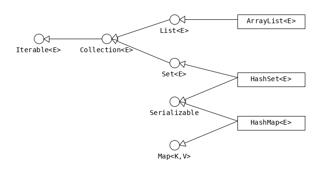
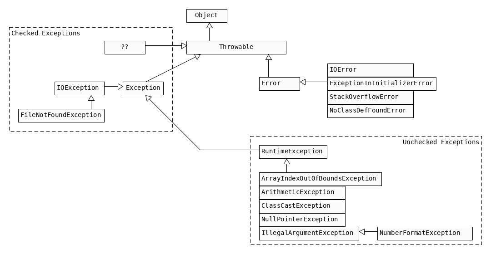

## 01 About
| | | |
---|---|---
JDK     | | Java Development Kit : minimum software needed for Java development.
Compiler | `javac` | _Compiles_ from sourcecode contained in `.java` files.  _Compiles_ to `bytecode` contained in `.class` files.
Launcher | `java` |Launches the JVM.   JVM _interprets_ the bytecode .
 Archiver| `jar` | 
 | | `javadoc` | generates documentation.
| API | | StringBuilder is an API.
    
#### 8 Benefits
| | |
---|---
Object Oriented | All code is defined in classes.
Encapsualtion | - Access modifiers   - Local scope of variables
Platform Independent | bytecode runs in any JVM
Robust| no memory leaks
| Simple | no pointers, no operator overloading
| Secure | JVM creates a sandbox
| Multithreaded | 
| Backward Compatibility | APIs about to be obsolete are flagged as _depreciated_ .

 

#### Building Blocks
* _keyword_ word with special meaning. 
* _variables_ hold state
    * have _type_
* _methods_ operate on state
* _member_ all that is inherited
    * _fields_ : variable declared outside of method, but inside class.
    * _methods_ (=functions) (operate on state)
        * methods have parameters
        * _method signature_ = name + parameter types
        * _method declaration_ = full line (?)
    * _nested classes_
    * _interfaces_
    * _enumerated types_
    * NOT _Constructors_ , since those are not inherited.
* Comment
    * `/* */ */` does not compile, as there is one `*/` too much.

| | |
---|---
`Integer integer = new Integer(0);` | `<type>  <name>   = new     <constructor> ;`
`{}` | block
`a=1+1;` , `a++;` | statement
`1+1` , `a++` | expression

                          // a brace is missing == "balanced parantheses problem"
    public class Foo {    // class definition
        {int bar = 1;}    // instance initializer
        void bob(int i){  // method definition
            {i++;}        // inner block
    }   }

 

#### Variables

* Variables can't be declared outside of a class or interface.
* Fields
    * Instance Variable: (non-static) , declared within a Class.
    * Class Variable : `static` , declared within a Class.
* Local Variable : declared within a Constructor, Method or Initializer Block.
* Constant : `final` variable.

    int i;       // declaration
    i = 1;       // write access "set"
    i = i + 1;   // read & write access "get & set"

##### Identifier Name
* must begin with letter , $ or _
* can include numbers
* a single _ is not allowed as identifier (since Java 9)
* cannot be reserved
* can't contain non char operators e.g. `+` , `%` , `~`
* unicode letters, e.g. arabic are allowed.

##### Compound Declaration

* may or may not be initialized.
* only one type declaration allowed.

    int i1, i2, i3=0;  // OK
    int a, int b;      // NO , multiple declarations not allowed.
    int i1, String s1; // NO , multiple declarations & not of the same type.
    int a; int b;      // OK , two statements.
    int a; b;          // NO , b is not a statement.

##### Initializing Variables
* Instance Variables have default values:

    boolean                  false
    byte, short, int, long   0
    float, double            0.0
    char                     '\u0000' (NUL)
    Objects                 null
    
    

* Local Variables do not hat a default value
    * compiler will throw error, if the code reads an un-init var
    
    
    int i, x;
    if (check){
        i=0; x=0;
    } else {
        i=1;
    }
    int a = i; // OK // i is initialized either way
    int b = x; // NO // reading uninitialized variable
    
    
##### Parameters (constructor or method)
* are local variables, that have been pre-initialized
* C-Error: `int i; find(i);`

 

#### `var` 
* local variable type inference

| yes | no|
---|---
can only be used with local variables | can't be used with fields
must be initialized when declared | can't be used with parameters
can be used for reference types | can't be assigend `null` ,   since impossible to guess type.
is a _reserved type name_.    can't be used for _class_, _interface_, or _enum_ declarations | is not a _reserved word_.
 - |can't be used in multiple-var declaration

#### Scope
* the scope of the variable is the code block it is declared in
* for parameters the scope is the method/class
    * start: when declared
    * end: when brace is closed
* instance var
    * start: when declared
    * end: lifetime of object ends (object eligible for GC)
* class var
    * start: when declared
    * end: life of the program ends
    
#### GC
 * all Ojbects are stored in _heap_ (_free store_).
    * pool of unuserd memory allocated to the Java application.
*  Object is _eligiblie for GC_ = no longer accessible in program
    * Object no longer has any references pointing to it.
    * all references to the Object have gone out of scope.

        System.gc();
        
* suggests JVM to do GC, JVM may comply.
* example

        String a = new String("a");
        String b = new String("b");
        a=b; // String "a" just went out of scope
        b=null; // String "b" is still in scope
* Side Node:
    * finalize() was intended to run when the object was GCd.
    * it can run only once
    * not part of exam, since deprecated

## 014 Deployment

#### Command Line
`class Core` in file `Core.java` in directory `/pkg` 
        
| no package | with package
---|---
| | file contains statement `package pkg;`  
`javac pkg/Core.java` | `javac pkg/Core.java`
`cd ./pkg` then `java Core` | `java pkg.Core`
 
 
        

#### One Line 
Normal | One Line
---|---
`javac Core.java` | `java Core.java`
`java Core` | 
Produces class file | Fully in memory
For any program | For programs with one class
Can import any library | Can ony import code that came with the JDK.

* One Line ignores packages, thus a `Main.java` in `package one.line.pkg;` can be called as:
    * `java ./one/line/pkg/Main.java`
    * `java Main.java`

#### Packages
* _Declaration_ : `package pkg;`
* _Fully qualifed class name_ : `java.util.Date foo;`

#### Imports

    import java.util.Random;
    import java.util.* // wildcard
* _wildcard_ : compiler figures out what is needed
    * only imports classes
    * static imports may import methods, see Ch.7
* redundant imports:
    * `java.lang` is auto-imported
    * classes of same package are auto-imported
* invalid imports

    import java.nio.*              // can't match "files.File"
    import java.nio.*.*            // only one * allowed
    import java.nio.file.Paths.*   // can import methods
    
assuming java.util.Date and java.sql.Date
    
    import java.util.*; import java.sql.*;        // causes Date declaration to C-Error 
    import java.util.Date; import java.sql.*;     // OK
    import java.util.Date; import java.sql.Date;  // C-Error (even if not used)
    

#### `javac` Options
* _Directory_ 
    * `-d` : overwrite target directory for .class files 
    * `javac -d ./out ./pkg/Core.java ./other/pkg/NotCore.java `
* _Sourcepath_
    * `cd ./src/deployment/pkg`
    * `javac -sourcepath ../pkg Main.java`
    * `cd ..`
    * `java pkg.Main`
* _Modulepath_
    * `-p , --module-path`

#### `java` Options
* _Classpath_ : indicates where .class files are located
    * `java -cp ./out pkg.Core`
    * also `-classpath` , `--class-path`
    * possible to use multiple paths
        * look in current dir and in ./out and in foo.jar
        * Win: `java -cp ".;./out;./foo.jar`
        * Unix: `java -cp ".:./out:./foo.jar`

    
 
#### Examples
##### no.pkg
* _Default package_ : if nothing is specified
##### pkg

* Example : 
    * `cd ./src/deployment`
    * `javac ./pkg/Core.java ./other/pkg/NotCore.java`
    * with wildcards: `javac ./pkg/*.java ./other/pkg/*.java`
    * `java pkg.Core`

## 016 Jar
* Java Archive
* Security: 
You can digitally sign the contents of a JAR file. 
Users who recognize your signature can then optionally grant your software security privileges it wouldn't otherwise have.
* Packaging for extensions: 
The extensions framework provides a means by which you can add functionality to the Java core platform, and the JAR file format defines the packaging for extensions. By using the JAR file format, you can turn your software into extensions as well.

|Operation|Command|
| --- | --- |
`c`| create
`f`| file : a jar file description will follow
`m`| manifest : a manifest will follow, manifest/file must be in same order as `mf`.
`t`| table of contents : prints table of contents
`x`| extract
`u`| update
`e`| entry point : overrides the main-class set in the manifest
`<input>` | Can be a file, a list of files, a wildcard or a directory 
`-C`|  input directory. `jar -cf foo.jar -C pkg Main.class` ~ `jar -cf foo.jar pkg/Main.class`
`jar cf foo.jar <input>` | create JAR
`jar cfm jar-file manifest input-file(s)` | create JAR with manifest-addition|
`jar tf jar-file` |view contents
`jar xf jar-file1`|extract contents to current directory|
`jar uf jar-file <input>` |update (add/overwrite)|
`jar cfe Core.jar pkg.Core pkg/Core.class` | set entry point (directly set main class)|
`java -jar app.jar`|run|

### Manifest Files
JAR files support a wide range of functionality, including electronic signing, version control, package sealing, and others. What gives a JAR file this versatility? The answer is the JAR file's manifest.

The manifest is a special file that can contain information about the files packaged in a JAR file. By tailoring this "meta" information that the manifest contains, you enable the JAR file to serve a variety of purposes.

This lesson will explain the contents of the manifest file and show you how to work with it, with examples for the basic features:

app.jar/META-INF/MANIFEST.MF

Default manifest:
Manifest-Version: 1.0
Created-By: 1.7.0_06 (Oracle Corporation)

##### Class-Path
When a JAR (i.e. Applet) references other JARs (equiv. to using `java -classpath`).
 
`Class-Path: jar1-name jar2-name directory-name/jar3-name`

##### Package Version
|Header 	|Definition| 
| --- | --- |
|Name 	The name of the specification.
|Specification-Title| 	The title of the specification.|
|Specification-Version |	The version of the specification.|
|Specification-Vendor |	The vendor of the specification.|
|Implementation-Title |	The title of the implementation.|
|Implementation-Version |	The build number of the implementation.|
|Implementation-Vendor 	|The vendor of the implementation.|

##### Sealing a pkg
all classes defined in that package must be archived in the same JAR file.
Name: myCompany/firstPackage/
Sealed: true

Name: myCompany/secondPackage/
Sealed: true

or just seal the entire JAR

Sealed: true

    

## 02 Data Types

* Java works with _objects_ that contain collections of Primitive Data Types.

#### reference vs. instance vs. object
* _variable_ whose type is a reference type
    * holds a _reference_
* _reference_
    * holds the address of an _instance_
    * always of same size (=length)
    * a reference can be held by multiple variables
    * `new Object()` creates a new reference
* _instance_
    * holds the physical address of an _object_
    * the physical address is invisible in Java.
* _object_
    * physical object in memory
    * `new Object()` causes an _object_ to be created in memory
    
    
    Object obj = null;       // obj is a variable. here it holds a referenct to null
    new Object();            // new Object() is an reference to an instance of the Object class
    obj = new Object();      // obj now holds a reference to an instance of the Object class
    
    System.out.print(obj);   // java.lang.Object@6acbcfc0
    

#### 8 Primitive Types
* Contain a pointer to a value in memory.
    * Thus have fixed size.
    * Thus upon declaring a Primitive Type, Java will directly allocate memory according to the size of the Primitive Type.
* Can't contain `null` (as they don´t contain an pointer to an _object_ in the first place).
* _mutable_.

#### Reference Type
* holds pointer to memory address of object
    * unlike other Languages, Java does not allow to know what the physical memory adress is
* a reference can be assigend to another object of the a compatible type
* _immutable_.

#### mutable vs immutable
* primitives are immutable
* String , Integer , Char etc. are immutable
* StringBuilder, List are mutable

 

#### Wrapper Classes
* Wrapper classes make use of some caching, somilar to the pool for String
* The ability of Wrappers to contain `null` is useful for data services.

P-Type | W-Class | .valueOf(<>) | Wrapper.parse<>()
---|---|---|---
boolean | Boolean | true
byte |
short |
int |   | | parseInt
long | | | parseLong
float | | (float) 1.0)
double | Double | 1.0
char | Character | 'c'

    int primitive = Integer.parseInt("123");
    Integer wrapper = Integer.valueOf("123"); // may throw NumberformatException

##### Autoboxing and Unboxing
* Autoboxing `Integer integer = 50;`
* Unboxing `int i = integer;`
    * NullPointerException: `int i = new Integer(null)`

    

## 03 Operators
* _operand_ : variable, literal, value
    * variable : `foo`
    * literal : `1`  ()
    * value : a series of bits in heap 
* _operator_ : special symbol that can be applied to a set of operands

#### Types of Operators

* unary (one operand), binary (two operands), ternary (three operands)

#### Precedence
* according to precedence
* if same precedence, then left to right
 * Precedence may be overridden with parentheses ().
    * Java does not allow brackets [].
    * Java does not allow braces {}. 

Order | Operator (by precedence DESC) | Example
--- | --- | ---
1 | post-unary | expr++, expr--
2 | pre-unary | ++expr , --expr
3 | other unary | - , ! , ~ , + , (type)
4 | mult/div/mod | * , / , %
5 | add/subtract | + , -
6 | shift   | << , >> , >>>
7 | relational | < , > , <= , >= , `instanceof`
8 | (not) equal to | == , !=
9 | logical | & , ^ , \|
10 | ternary | boolean expr ? expr1 : expr2
11 | assignment | = , += , -= , *= , /= , %= , ^= , <<= , >>=, >>>= 
 
 
 
 Operator | What it does
 --- | ---
 -expr | negates the literal or variable
 
 
#### Binary Arithmetic Operators
 

##### Rounding
* "floor" of 4.9 is 4 (the next smalles integer value)

##### Numeric Promotion
Not at assignment, but each time an operation takes place, the following rules are applied in the following order:
1. `byte` , `short` , `char` are promoted to `int` before being used with a binary arithmetic operator.
    *  unary operators are excluded from this rule (`++short` is still `short`)
1. IF operands have different data types, 
    * IF both operands are integer, THEN promote operands to the "largest" data type.
    * IF one operand is floating-point, THEN promote integer operands to floating-point operands.
1. The result of the operation has the same data type as the promoted operands.

        short w = 14;
        float x = 13;
        double y = 30;
        var z = w *x / y;
        
        type "resolution":
        
        var = short * float / double;
        var =   int * float / double;
        var = float * float / double;
        var =         float / double;
        var =        double / double;
        var =                 double;

#### Assignment Operators
Operator | What it does
 --- | ---
 a = b | assigns the value on the right to the var on the left.
 
 ##### Casting
 * See `about.basics.classes.Main.polymorphism`
 * optional from smaller to larger types.
 * mandatory from larger to smaller types
 * because casting is an unary operation, use parantheses where necessary
 * the space between operator and operand is optional.
 
        short foo  = (short)(1+2);
 
##### Compound Assignment Operators
* see `bout.basics.Operators.Assignments`
* `+=` , `/=` , `*=` , `-=`
* assignee must have been declared prior (obviously).
    * `foo *= a + b; //equiv// foo = foo * (a + b);`    
* compound assignment operators obscure casting
* an assignment operation can be used as a operand

        
        
#### Comparing Variables
  | | | primitives | reference types |
 ---|--- | --- | ---
 Sameness | `==` , `!=` | checks if same object   | checks if same reference
 Equivalence | `a.equals(b)`| - | check if same object
 

* comparing 
    1. two num or char primitive types, if different data types, then promoted
        * 5 == 5.00    becomes  5.00 == 5.00
        * remember char are promoted to int
    1. two variables/literals of type boolean
    1. two references (including `null` and references to objects of type `String`)
        * `null==null` is true.
* compareTo()
    * imagine: `a.compareTo(b) = a - b;`

### Relational Operators
* boolean
    * `>` , `>=`, `<`, `<=`
    * `obj instanceof Object`
        * may be used before Casting
        * `null instanceof Object` is always `false`
        * C-Error: `null instanceof null`
        
#### Logical Operators
* Logical
    * AND `&` , OR `|` , XOR `^`
* Short-cirquit: 
    * If first clause suffices to determine the result, the second clause is not evaluated.
    * AND `&&` , OR `||`
    * Usage: `if(list!=null && list.get(1){ }`
    
##### Unperformed Side Effects:

    int i =0;
    boolean b = (i==0 || (i=i+1)==0); // this is valid syntax
    // i remains 0 , because clause after || is never evaluated

#### Ternary Operator

    int i = 0;
    String s = i<2 ? "val if true" : "val if false";
    
    Object find(int i){
        return i>0 ? new Integer(1) : "foo"; // OK to have different types
    }
    
        
 * obvious Unperformed Side Effects see `Logic.java`.

    

## 04 Control

* the target of an decision-making statement can be a
    * single statement
    * block            
* reminder : 0 and 1 are not boolean value in Java

#### switch
* see `control.Logic.switchTest()` 
1. goto matching case
1. IF no matching case available, THEN  goto default
1. execute everything below the current statement
    * this is why optional `break` statements are used 
* `switch` does ot allow `continue` statement.
* allowed `switch` types:
    * `short` , `Short` , `int` , `Integer`
    * `byte` , `Byte` , `char` , `Character`
    * `String`
    * enum values
    * `var` (type resolves to one of the above)
##### case expressions
* no declarations allowed 
* be, or consist of, `C-time constant` expressions
    * literals
    * enum constants
    * `final` _constant_ variables
        * _constant_ ~ initialized when declared
        * _constant_ ~ not initialized by method (happens at runtime)
* match the `switch` type without an explicit cast (see `about.Castig`)

 

#### while & do while

* `while (booleanExpression){}`    
    * booleanExpression evaluated before each iteration
* `do {} while (booleanExpression);`
    * Loop is executed once before the expression is evaluated.    
* care: C-Error unreachable statement
    * `while(false){ i=1 }`
    * `while(true){} i=1;`

 

#### for
* `for (initializationStatement ; booleanExpression ; updateStatement) {}`
* Order of execution:
    1. init statement executes
        * the rules for multiple-declaration do apply.
    1. Evaluate Expression (_before_ body)
    1. Body executes
    1. Execute updateStatement
    1. Return to Step 2
* each of the 3 components of the for loop are optional
    * `for( ; ; )` ~ infinite loop.

#### enhanced for (for each)
* `for (datatype instance : collection){}`
*  _collection_ is either:
    *  array
    * X implementing `java.lang.Iterable` , e.g. `ArrayList` 

 

#### break & continue
* `break`transfers control to the next enclosing statement
    *  _label_ allows to break out of an higher-level loop
* `continue` transfers control to the expression that determines if the loop should continue.
* any statement after `break` , `continue` is unreachable -> C-Error

    

## 053 String
* see `about.string` .
* implements the `CharSequence` interface.
* concatenation 
    * if both opernads are numeric, + means addition.
    * if eiter operand is a String, + means concatenation.
    * evaluate from left to right.

    s = 1+2;        // 3
    s = "a"+1;      // a1
    s = 1+2+"a";    // 3a
    s = "a"+1+2;    // a12
    s+=2;           // s = s + 2 thus a122
    
* immutability
    * once a String object is created, it cannot be changed
       
       
#### StringBuilder
* see `about/StringBuilder`
* implements the `CharSequence` interface.

#### Equality
* reference equality : variable points to same object
    * beware when dealing with objects, e.g. arrays, 
    * since a new array with same contents will be a new object and thus not ==
    * checking for reference equality of two different types -> C-Error
* value equality : object has same properties
* `.equals()` 
    * depends on implementation by the object
    * for String it compares contents, and returns true if same.
    * for Objects in general it checks for refeence equality just like ==
        * StringBuilder
        * Array
        
#### String Pool
Strings use a lot of memory.
To reuse common strings java collects them in the string pool (a.k.a. intern pool)

* pool contains literal values and constants used by the program
    * `myObject.toString()` is a string but not a literal, so it does not go into the string pool.

 

## 055 Collections

* see `basics.collections`
    * for API see `InterfaceCopy` files

#### Array
* An array is a reference type (even if it is an array of primitives)
* see `about.basics.collections.Arrays`

##### Sorting
* sorts alphabetically  numbers before a before A

        java.util.Arrays;
        Arrays.sort(stringArray);
        [10 , 100, 9]

##### Binary search 
* only on sorted arrays , else unpredictable output
* found - return index ou match
* not found - return (negative value of index where searched would need to be inserted) - 1 

        int[] nym = {2,4,6,8};
        Arrays.binarySearch(num,2); // 0
        Arrays.binarySearch(num,1); // -1
        Arrays.binarySearch(num,3); // -2

##### Comparing
* `int` can be compared with operators (Ch.3)
* Objects e.g. `Integer` can be compared with
    * operators (e.g. `<`,`==`) , this will return a `boolean`.
    * `a.compareTo(b)` , this will return an `int`.
* Arrays can be compared with `Arrays.compare(a,b);` , this will return an `int`.
* Think of `a.compareTo(b)` and `compare(a,b)` as `a - b`. 

    Arrays.compare({1}, {1}); // 0
    Arrays.compare({1}, {1,1}); // -1
    Arrays.compare({2}, {1,1}); // 
        

* null is smaller than any other value
* for String : a < b if a prefix of b
* for char / String : a < b if
    * numbers < letters
    * UPPERCASE < lowercaser
    
when comparing , arrays must be of same type, else compilation error

##### mismatch()
* if arrays same, mismatch() = -1
* else mismatch return index of first index where they differ

##### varargs
main(Strings... args) // varargs , this is legal, args can be used normally

##### N-Dim Arrays
* Array can hold Objects,
* thus can hold Arrays.

#### ArrayList

        Arraylist<String> list = new ArrayList<>();

        var strings = new ArrayList<String>();
        strings.add("a");
        for (String s: strings) { }
        
        var strings = new ArrayList<>(); // assumes var has type List<Object>
        strings.add("a");
        for (String s: strings) { } // DOES NOT COMPILE

        Arrays.toString(a2D);
        Arrays.deepToString(a2D);
        
* List is an Interface, so
    * List<String> = new ArrayList<>(); is OK
    * ArrayList<String> = new ArrayList<>(); is OK
    * ArrayList<String> = new List<String>(); is not OK
    

| | |
---|---
`Collection` , `Map` | `int size()`
`String` | `int length()`
`Array` | `int length`

* `boolean contains(Object obj) // calls equals() on each element in the list`
    * ArrayList has a own .equals() implememtation
    * [a].equals([b]) true
    * [a,b].equals([b,a]) false

 

#### Conversions
| `about.basics.collections.Conversions` | toArray() | Arrays.asList() | List.of()
---|---|---|---
Types| List -> Array | Array/varargs -> List | Array/varargs -> List  
Collection mutable? | - | NO | NO
Entries mutable? | YES |  YES | NO
Sync | NO | YES | -
    
* `List<String> fixedSizeList = Arrays.asList("a", "b", "c");`
* `List<String> expandableList = new ArrayList<>(fixedSizeList);`

#### Sorting 
* `Collections.sort(list)`

#### Sets and Maps
* Sets
    * Are not ordered
    * Can't contain duplicates
    * See `Sets.java`.
* Maps
    * See `Maps.java`.

    

## 06 Lambdas
* see `about.basics.lambdas.Intro`
* Lambdas work with `functional` interfaces (interfaces that have only one `abstract` method)
    * optional annotation `@FunctionalInterface` to signal intent.
* Instead of implementing class/method
    * write just parameter and method body
* parentheses can be omitted if there is a single parameter and its type is not explicitly stated
* there isn't a rule that says you must use all declared parameters
* `<parameter name> -> <body>`
* `a -> a.foo()`
* `(a,b,c) -> { int d = a+b; int e = d+c; return e;};`
* IF one parmaeter omit ()
* IF one statement, omit { return ;}
* var can be used in Lambda parameters
* Lambda body may contain:
    * any Lambda parameters (the ones before `->`)
    * any class/instance variables (of the surrounding class)
    * `effectively final` parameters/local variables (of the surrounding method)
        * A variable is _effectively final_ if adding final before it would not cause an C-Error

 
    
#### Predefined Funtional Interfaces

| | 
|---|
|`Comparator<T> { int compare(T o1, T o2); }`
|`Consumer<T>      { void accept(T t); }`
|`Predicate<T>   { boolean test(T t); }` 
|`Supplier<T>   { T get(); }`    

 #### Calling APIs with Lambdas
 * See `Lambdas.java/LambdaAPIs`.
 * List and Set implement methods, that take Lambdas as parameters
     * `.removeIf(Predicate)`
     * `.sort(Comparator)`
     * `.forEach(Consumer)`

    

## 065 Declarations

| | | | | | | | 
---|---|---|---|---|--- |---
__access modifier__|__specifier__|__return type__|__method name__|__(list of param)__|__exception__|__{method body}__
optional | optional | |   | empty-able | optional | empty-able
public | final | void | foo | () | throws Exception | {int i=0;}
__access modifier__|__specifier__| __class__ | __class name__ |__extends__|__implements__|__{class body}__
| | optional | | | optional | optional |empty-able
public | final, abstract | class | Foo  | extends Bar| implements Zoc | {int i=0;}
    
* "signature of a method" = method name and parameter list (type and order).
    * the name itself is not unique.
    
 

#### Specifiers
* placement:
    * before/after _access modifier_
    * before 
        * `class`
        * _return type_

| specifier| class| method |
---|---|---|
`static` | 
`abstract` | can't be instantiated | 
`final` | can't be extended | may not be overridden
synchronized | - | for multithreading
native | - |  for C++ compat.
strictfp | - |  makes float operations portable.

 

#### Access Modifier
* order of _access modifiers_ and _specifiers_ does not matter
* private : only same class
    * not other class in same file. e.g. encapsulating class
* default : private + any class in same package 
    * (if access modifier is omitted)
    * C-Error: if keyword is used.
* protected
    * default + may be accessed in/through an instance of the child class
* public : anywhere

Construct | `private` | default | `protected` | `public`
---|---|---|---|---
top-level type (abstract-/concrete-class, interface)| | YES | | YES
outer class |  | YES |
inner class : declared inside another class | YES | YES | YES | YES
 
 

#### Illegal Combinations
* `abstract` + `private` = C-Error
* `abstract` + `final` = C-Error
* `final` + `private` = OK
* `abstract` + `static` = C-Error

    

## 07 Methods and Encapsulation

#### varargs
* Varargs : e.g. `int...`
    * similar to `int[]` for array
    * may additionally take `1,2`
* only one `...` allowed per paramter list
    * may only be used with the last prameter in parameter list.
* a method with a `int[]` parameter won't accept `1,2`
 * must have an `int...` parameter to accept `1,2`

#### static 
* Purpose
    * Helper methods, that don't require any object state.
    * State that is shared by all instances of a class.

    System.out.print(0);
    Store st = new Store(0); // stores 0
    int i = st.get();        // static method get() returns stored value
    st = null;
    i = st.get();           // st.get() is still 0

* `static initializers` : `static {i=1;}`
#### static vs instance
* See `about.StaticAbout` .

| | |
---|---
Instance Variable | one copy per object
Method (static and instance) | one copy
Method parameter & local variable (static and instance)| one copy per call

* static imports

    
    import java.util.Arrays;
    import static java.util.Arrays.asList;
    import static java.util.Arrays.*;
    
    import static java.util.Arrays;  // Error
    import java.util.Arrays.asList;  // Error

#### final
* Can't assign other Object to reference
* `final` fields are not initialized by default
    * `final int i=0;  // OK`
    * `final int i;    // C-Error` 

#### passing data
    {
        int i=0;
        foo(i);
    }
    void foo(int j){j=1;}
     
* Java is "pass-by-value"
    * the parameter is created as a new local variable
    * the parameter `j` holds the  same value as the original variable `i`
    * with mutable values 
        * modifying the parameter will cause a modification of the original variable
        * mutable reference type (`StringBuilder`)
    * with immutable values this is not a problem
        * primitive type (`int`)
        * immutable referene type (`Integer`)      
    * "pass-by-value" also happens on `return`.
* "pass-by-reference"
    * the physical address of the __variable__ is passed
    * `j` would point to the same physical address as `i`
    

#### Overloading
* _method name_ must stay the same.
* _parameter list_ must change.
    * changing `int[]` to `int...` (varargs) does not count, -> C-Error. 
* other parts of the declaration are irrelevant
    * only changing `return` type or `static` modifier `-> C-Error`
* see `about.basics.Methods`
* Autoboxing
    * defining both `foo(int i)` and `foo(Integer i)` -> OK
    * Java will use the primitive variant whenever possible
    * and autobox if the primitive variant is not present
* Reference types
    * defining both `foo(String s)` and `foo(Object obj)`
    * `foo(1)` will Autobox to Integer
    * `foo(new Integer(1))` will match with `foo(Object obj)` 
* Primitive types
    * defining both `foo(int i)` and `foo(long l)`
    * `foo(1)` will match int
    * `foo(1L)` will match long
* Generics
    * _type erasure_ generics are used only at compile time
    * `foo(List<String> a)` and `foo(List<Integer> a)`
    * both are compiled to `foo(List a)` `-> C-Error`
* Arrays 
    * don't have _type erasure_
    * `foo(String[] a)` and `foo(Integer[] a)` is a valid overload.
##### Order when Overloading
1. Exact match by type
1. Larger primitive type
1. Autoboxed type
1. Varargs
    
    
    void play(Long a){}
    play(4) // C-Error
    // int autobox Integer , can't cast from Integer to Long
    // int convert long, autobox from long to Long
    
    void play(Object a){}
    play(4) // OK can autobox from int to Integer, 
    
    void play (long a){}
    play(4) // OK can convert from int to long
    
    
* can't convert twice
    * from int to Integer
    * from Integer to Long
    
    TODO learn about conversions first
    
 

#### Encapsulation
* make field private
* make getter (accessor method) / setter (mutator method) with guards
* naming conventions
    * `boolean` : `.isFoo()` : `.setFoo()`
    * not `boolean` : `.getFoo()` : `.setFoo()`

    

## 08 Class

#### General

* `.java` file can have 0 or 1 public top-level classes.
    * `C-Error` if filename does not match name of public class.
* `this.var` references current and inherited members
    * sed do set apart instance/class variables from parameters/local variables
* `super.var` reference to inherited members
    * used to call members of the Parent class from the Child class.
* `this(int i)` is used to call overloaded Constructor.
* Java supports only single inheritance

 

#### Ordering of Elements
Element|Example|Required|Placement
---|---|---|---
Package declaration | `package foo;`|NO | First line in the file
Import statements | `import bar.*;`|NO | After the package
Class declaration | `public class C`| YES | After import
Field declarations | `int i;`| NO | Any top-level element in class
Method declarations | `void method()` | NO |  Any top-level element in class

 

#### Constructors
* The purpose of a _constructor_ is to initialize fields.
* Match the name of the class
* may have different access modifiers, 
    * overloading rules do apply
* if a user-declared constructor is present, the default constructor is not declared in the background
    * thus calling the default constructor -> C-Error.
    * having a private constructor effectively disables the instantiation of the class from outside.
* `this()` and `super()` must be the first statement in the constructor
    * `Foo(){this();}` does not Compile, likewise other circular references caused by constructors. 
* if no `this()` and `super()` are present the compiler inserts a `super()` in the background
* Trivia:
    * since compiler inserts super() the parent constructor is called in every child
    * if class has private constructor
        * it can only be extended by inner classes.
* Relevant:
    * Parent has no-default constructor
    * Child has no (or no matching) constructor.
    * C-Error, since compiler will insert call to default constructor of parent.
* super() refers to most direct parent
* see `about.basics.classes.Constructors`

 

##### `final` with Constructors
* final can be assigned values
    * in the line in which they are declared 
    * in an instance initializer 
    * constructor
 * `final` local variable may be assigned a value
 * `final` field not assigned after constructor `-> C-Error`
    * assigning `null` counts as an assignment
 
  
 
 #### Order of Initialization
 * aka _class loading_
 * a `class` is initialized either when
    * program starts
    * static member of the class is referenced
    * shortly before instance of class is created
    
 ##### Order
1. `static`
    1. init `super` first (start with highest)
    2. `static` var declarations (in order of appearance)
    3. `static` initializers (in order of appearance)
1. `instance`
    1. init `super` first
    2. instance var declaration (in order of appearance)
    3. instance initializers (in order of appearance)
    4. Initialize the constructor including any overloaded constructors referenced with `this()`.
        1. `this()` or `super()` if present
        2. default `super()`
1. what ever instance method is called

 

#### Reviewing Constructor Rules SKIP

 

#### Inheriting Members
* same _signature_ and compatible return type
    * thus same name, parameters and return type
    * `super` allows to reference parent method
    * `this` references the child method
* Checks performed when overridng a method
1. child method must havve same signature as parent method
2. child method must be at least as accessible as parent method
    * `Child` contains `private foo()` , `Parent` contains `pubic foo()`
    *  `Parent parent = new Child();`
    * reference type is `Parent` , instance is of type `Child`
    * `parent.foo()` -> Error
    * to avoid this, hild acess modifiers must be _wider_
3. child method may not declare a checked exception that is new or 
    broader then those in the parent method
    * child exceptions must be _narrower_
    * if reference type is narrower than instance type this might cause problems
4. if method returns a value, it must be same or a subtype of the method
    in parent method
    * aka _covariant return types_
    * again, something going `parent <- child`
    * must be narrower in child
    * `void` is only covariant with `void`
5. `static` methods can't be overridden with `instance` methods and vice versa.
    * if signature differs `static` and `instance` method wit same name may coexist.
    * however this blocks one overload each.
    * static methods are hidden, not inherited
    
#### Subtype and Supertype
* if X subtype of Y , then
    * X, Y class -> X subclass of Y
    * X, Y interface -> X subinterface of Y
    * X class, Y interface -> X implements Y (directly or through superclass)
#### Overload vs Override vs Hide vs Redeclare
|   | member | modifier |name |parameters | return type|
---|---|---|---|---|---
Overload | instance method | | same | __different__ | __any__
Override | instance method | |  same | __same__ | __covariant__
Hiding | instance/static field, static method | | same | same | covariant
Redeclaring | | (both) private  | same | same | !covariant
Illegal | | !private | same | same | !covariant
* Overriding : replaces the parent method.
* Hiding : replaces the member only if a Child reference type is used.
* Redeclaring : is always ok, since accessing the member from outside the class is prohibited anyways.

#### Overriding with Generics
* due to `type erasure` can't overload `foo(List<Integer>)` with `foo(List<String>)`
* thus overriding `foo(List<Integer>)` with `foo(List<String>)` would be seen as an illegal overload
* instead it's ok to override `foo(List<Integer>)` with `foo(List<Integer>)`
* `Parent.foo(List<Integer>)` with `Child.foo(ArrayList<Integer>)` will cause an OK overload.
* for 816
    * wildcard for generics is `<?>` 
        * `<? super String>` and `<? extends String>` is ok too
* generic return types 
    * generic must be exactly same
    * return type of overriding method may be coviant
        *  Parent `List<String> foo()` Child `ArrayList<String> foo()`
* final methods
    * can't be overridden or hidden
    * still could be redeclared (if private in parent)
* special
    * Parent : `pubic int i=0;`
    * Child : `private int i=3;`
    * 3 reference paths : new Parent(), new Child(), Parent childAsParent = new Child())
    * we are executing main from child
    * parent.i == 0
    * child.i ==3 // thus hiding works
    * childAsParent == 0 // hiding still works // just __beware__ accessing private from outside of class
    
    
#### Polymorphism
* See `about.basics.classes.Polymorphism`

#### Interfaces
* `interface`
    * can define `abstract` methods
    * a `class` can implement many `interfaces`
    * class implements interface by overriding the inherited abstract methods

* One object or one method call show different behavior.
#### 2 Types of Polymorphism
* Overloading (C-Time Poly) : resolved at C-Time
* Overriding (R-Time Poly) : resolved at R-Time
* type of _object_ (in memory)
    * immutable
* type of reference (data type)
    * determines api
* ??? is casting nothing more than reclaiming the full api of the child class

    

## 09 Class 2

#### Abstract Classes
* see `basics.classes.AbastractClass`
* may contain abstract methods
    * without body: `abstract void foo();`
    * does not define an implementation upon declaration
    * must be overridden in first _concrete class_
        * overriding rules _DO_ apply
* `abstract` classes may contain anything an concrete class contains
    * not true vice-versa

#### Constructors in Abstract
* main difference:
    * can only be called by instantiating subclass
* see `about.basics.classes.AbstractDemo`
    
   

#### Interfaces
* may be public or default
* may include:
    * abstract methods
    * constant variables
* all members of an interface are assumed to be public
* since Java 8 may include
    * static methods
    * default methods (concrete, has body)
* since Java 9 may include 
    * private
    * private static methods
    * added for code-reuse with interface, cannot be called from outside.
* `interface` provides implicit modifiers
    * thes must be written explicitly in class implementing interface
* call may implement multiple interfaces, separated by comma
    * class must implement all of the abstract methods contained in 
    the interfaces.
    * if 1+ interface contain identical methods
        * imlementing class overrides them all at once.
* `interface` may extend multiple interfaces (spearated by comma)
    * ok, since no Constructors / concrete instance members present
    * some rules of class declarations apply
        * .java file may have at most one public top-level interface, must match name
* abstract type inheriting from interface is not required to implement or declare inherited methods
* interface cant extend class
    * nothing can implement class
##### overriding two interfaces
* if declarations in both interfaces are compatible
    * just override them
* if signatures of both declarations are different
    * it's an overload
* if signatures are same
    * overriding rules apply
    
    
#### Enums
* out of scope for 815.
 
### Poly and Ifaces
* when using abstract reference (e.g. inface) for concrete class
    * wish to access memeber which exist in concrete class only
    * explicit cast from e.g. infterface to class
        * mus be compatible
* `instanceof`
    * if reference type is final compiler will detect 
    * if reference type is abstract it might be extended to become an instance of
        * thus compiler can't check  
    
#### Inner Classes / Interfaces
* member of a class
* can have all 4 access modifiers ( top-level classes/interfaces can only be public/default)
* can't contain static methods

    

## 10 Exceptions

* Exceptions do alter the program flow.
* Since `Throwable` includes `Error` , do not catch `Throwable` directly.
* see `about.basics.Exceptions`
* _handle_ means `try/catch`
* _declare_ means `throw`
* if attempting to catch `cE` (not relevant for `uE`) that the try-block is unable to throw
    * then Compile-Time Error
* `Errors` Exceptions that the programmer should not attempt to handle.

                        
 
    
Type | May be declared | May be handled | Must be declared/handled
---|---|---|---
Unchecked Exception `uE`  |Yes| Yes | No
Checked Exception `cE` |Yes| Yes | Yes
Error  |Yes| No | No

 

RuntimeExceptions |  |
---| ---
ArithmeticException | Thrown when code attempts to divide by zero
ArrayIndexOutOfBoundsException | Thrown when code uses an illegal index to access an array
ClassCastException | Thrown when an attempt is made to cast an object to a class of which it is not an instance. e.g. `String s; Integer i = (Integer)s;`.
NullPointerException | Thrown when there is a null reference where an object is required
IllegalArgumentException | MANUALLY thrown by the programmer with `throw` to indicate that a method has been passed an inappropriate argument
NumberFormatException | Subclass of IllegalArgumentException! Thrown when an attempt is made to convert a string to a numeric type but the string doesn’t have an appropriate format. e.g. `Integer.parseInt("ab");`.
**Checked Exceptions** |                    
IOException | Thrown programmatically when there’s a problem reading or writing a file
FileNotFoundException | Subclass of IOException! Thrown programmatically when code tries to reference a file that does not exist
**Errors** |                            
ExceptionInInitializerError | Thrown when a static initializer throws an exception and doesn’t handle it
StackOverflowError | Thrown when a method calls itself too many times (infinite recursion)
NoClassDefFoundError |  Thrown when a class that the code uses is available at compile time but not runtime.

###### ExceptionInInitializerError
Java runs static initializers the first time a class is used.

    static { int[] arr = new int[3];  int i = arr[-1];  }

#### Syntax Rules
* try/catch requires all braces to be present
    * only if and loops allow to omit braces for one-liners.
* there may be multiple catch blocks
    * evaluated in the order they appear in
    * only one may run
    * if superclass Exception catch before subclass catch -> C-Error
* multi-catch block see `Exceptions.java` .
    * declaring inheriatance-related Exceptions in a multi-catch will result in a Compile-time error
        * even if child comes before parent.
* order of try/catch/finally matters
* either catch OR finally must be present.

#### finally
     int goHome() {
      try {
          // Optionally throw an exception here
          System.out.print("1");
          return -1;
      } catch (Exception e) {
          System.out.print("2");
          return -2;
      } finally {
          System.out.print("3");
          return -3;
      }
     }

* finally is always executed before try/catch return
    * thus here return is always -3
    * print is either 12 or 13 depending if an Exception occurs.
* Special case: finally is not executed

    try {
    System.exit(0);
    } finally {
    System.out.print("Never going to get here"); // Not printed
    }

#### try-with-resource
* resources are : databases, webservers, filesystems
resource leak just as bad as memory leak
*  use finally to close the resources

    try (FileInputStream in = new FileInputStream("foo"); FileInputStream in = new FileInputStream("foo"); ){
        //some code
    } 
    
* does not support compound declaration
* an user `var` since resources are local variables
* catch block is optional (since finally clause exists implicitly)
* a implicit finally block is created that closes the resources in the reverse order they were created
* optional `catch` block runs after implicit finally
* an explicit finally block, if defined by the programmer, is executed after the explicit block
* only Classes that implement the Interface AutoClosable can be used in try-with-resources blocks.
    * because they must implement `.close()`
* scope of resource is only the try block.

##### Overriding Methods with Exceptions
* this applies only to checked exceptions
    * overridden method in a subclass is allowed to declare fewer exceptions that the superclass or interface.
        * this is legal because callers are already handling then (???)
    * overriden method is allowed to declare a child of the exception the parent method throws

    

## 11 Modules
#### Benefits
| | |
---|---
Better Access Control | 
Clearer Dependency Management | 
Custom Java Builds | 
Improved Performance |
Unique Package Enforcement | 

* --modulep-path
    * location of any custom module files
    
    
java --module-path feeding --module zoo.animal.

#### `java` Options
`--describe-module` 

provides uses opens also exist

* package names must still be unique across all modules
    * if both modules contain `pkg` error when compiling.
    
    
* `requires transitive foo` : this module depends on `foo` and its dependencies
     
