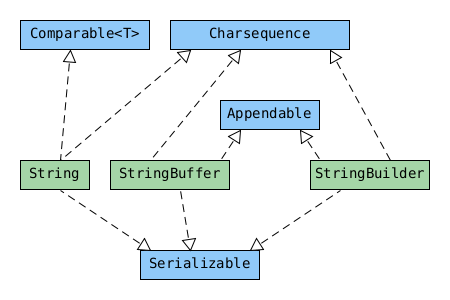

== String
* see also examples in the `.java` files.

* implements the `CharSequence` interface.
* concatenation
    * if both opernads are numeric, + means addition.
    * if eiter operand is a String, + means concatenation.
    * evaluate from left to right.

[source,java]
s = 1+2;        // 3
s = "a"+1;      // a1
s = 1+2+"a";    // 3a
s = "a"+1+2;    // a12
s+=2;           // s = s + 2 thus a122

* immutability : once a String object is created, it cannot be changed

{empty} +

==== StringBuilder & StringBuffer

|===
| | String | StringBuilder | StringBuffer
| Immutable | YES | |
| Pooled | YES | |
| Thread-safe | YES | | YES
| Appendable | | YES | YES
|===

{empty} +

==== String Pool
* Strings use a lot of memory.
* To reuse common strings java collects them in the string pool (a.k.a. intern pool)

* pool contains literal values and constants used by the program
** `myObject.toString()` is a string but not a literal, so it does not go into the string pool.

