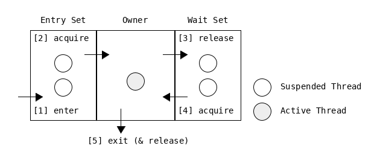
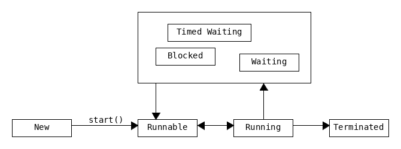
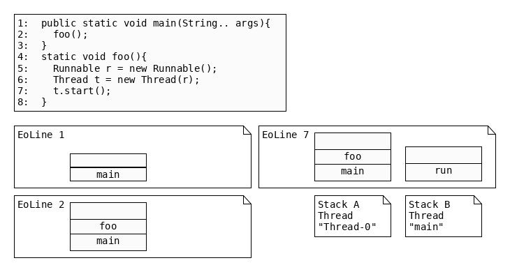
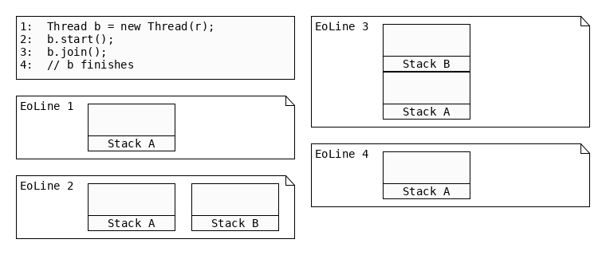

= Synchronization

The document is structured in the following manner:

[cols="10,30"]
|===
|Principles| What are Monitors?
|Writing Monitors| How to write monitor regions?
|Threads & Runnables| How to call monitor regions?
|Methods| How do monitor regions interact?
|Conflicts | What conflicts can result out of interactions between monitor regions?
|Thread Scheduler | To be classified.
|===

== Principles

Synchronization consists of _mutual exclusion_ (mutex) and _cooperation_.

[cols="10,30"]
|===
| Monitor |
    Every Java object has a single monitor. A monitor can be owned by one thread. +
    Every `class` also has a single monitor. It is used for synchronizing static _monitor regions_.
| Owner | Thread that owns the monitor.
| Tournament |when a monitor is released - generally the threads in entry set will compete for it.
| Monitor Region | Is a section of code.
A monitor may be associated with multiple regions.
While a thread executes a monitor region,
no other thread may execute another monitor region of same monitor. +
Examples: +
> synchronized method +
> synchronized block
|===

[cols="10,20,60"]
|===
|[1]|entering the monitor |
    Thread arrives at the beginning of a _monitor region_.
2+|Entry Set |
    Thread will participate in next tournament.
|[2]| acquiring the monitor |
    Thread won the _tournament_. +
    Thread becomes _owner_. +
    Thread starts executing _monitor region_.
|Owner|owning the monitor|
    Owner may: +
    > `Object.notify()` to notify a random thread in _wait set_. +
    > `Object.notifyAll()` to notify all threads in _wait set_.
|[3]| releasing the monitor|
    Owner calls `Object.wait()` & moves to _wait set_. +
    Tournament starts. +
    `Object.wait(1000)` may specify a timer. +
    When timer expires, the waiting thread will "notify itself".
2+|Wait Set |
    Waiting threads only participate in tournament if notified.
| [4] |acquiring the monitor |
    Owner executed `Object.notify()`. +
    Owner exited the monitor. +
    Thread in _wait set_ may compete for ownership.
|[5]| exiting the monitor| Owner finishes executing a monitor region. +
Tournament is started.

|===

[cols="5,10",options=header]
|===
|Sentence|Meaning
|wait and notify| `wait()` and `notify()` are used.
|signal and continue| Owner first signals via `notify()`. +
Owner then continues executing the monitor region.
|===

'''

== Writing monitor regions

[cols="4,3,25"]
|===
| non-static | method |
    > When entering the thread acquires the monitor to `this` (instance of methods class). +
    > Other threads can't enter any of the `synchronized` methods of `this`.
| non-static | block|
    > `synchronized(this){}` +
    > Possible to replace `this` with the instance of another `Object`.
| `static` | method |
    > When entering the thread acquires the monitor to the `java.lang.Class` of the class +
    > Each `class` has a corresponding instance of `java.lang.Class`
| `static` | block|
    > `synchronize(MyClass.class){}`
|===

==== Conclusions:
** `static` and non-`static` _monitor regions_ don't block each other.
** For blocks it matters what object is used as lock.
** Two instances have two locks, thus don't block each other.
** Use static setters for static fields.

==== Examples

[cols="10,30"]
|===
|`concurrent_modification.Problem.java`| Concurrent modification leads to corrupted data.
|`concurrent_modification.Solution.java`| by using `synchronized` setter.
|`concurrent_modification.SolutionFail.java`| Synchronization fails if synchronization happens on two different objects.
|`WaitNotify.java` | Shows how wait/notify and wait(100) interact.
|`ThreadMethods.java` | Overview of static/instance methods of `Thread`.
|===

'''

== Thread & Runnable

* `Thread` : worker
* `Runnable` : job to be done

=== Thread

* `java.lang.Thread` == Object.
* *thread of execution*
** individual process
** has its own call stack (one *thread* per call stack, vice versa)

* `main()` has a Thread called `main`.
* different JVM implementations may handle threads differently
** write code so that this doesn't matter
* ways to define & instantiate a thread
** extend `Thread`
** implement `Runnable` (preferable)

==== States

[cols="10,40"]
|===
|  `NEW`|
    `Thread` is instantiated. +
    Thread of execution is not yet started. Not alive.
| `RUNNABLE`|
    Thread of execution was started with `start()`. +
    Alive & eligible to be RUNNING.
| `RUNNING` |
    Scheduler chose thread of execution from the runnable pool.
|`BLOCKED`|
    Not eligible to run. +
    Thread is waiting for a different thread to release its lock in order to get the monitor lock.
| `WAITING` |
    Not eligible to run. +
    The thread is waiting by using a wait, join or park method. +
    Usually something in its own `run()` causes the Thread to wait.
| `TIMED_WAITING`|
    Not eligible to run. +
    The thread is waiting by using a sleep, wait, join or park method. +
    (The difference from WAITING is that the maximum waiting time is specified by the method parameter, and WAITING can be relieved by time as well as external changes.)
| `TERMINATED`|
    after `run()` completes.
|===

==== Dead vs. Alive
* Dead : before `start()` is called, after `run()` is completed.
* checked by `isAlive()`.

'''

'''

==== Types
* daemon
** stop working when there are no other non-daemon threads.
** Even if you do not create any threads, the Java application will create several threads by default.
** Most of them are daemon threads, mainly for processing tasks such as garbage collection or JMX.
* non-daemon
** A thread running the 'static void main(String[] args)’ method is created as a non-daemon thread,
** and when this thread stops working, all other daemon threads will stop as well.
** (The thread running this main method is called the VM thread in HotSpot VM.)

'''

'''

=== Runnable

.Two Stacks Example

'''

== Methods

=== List of Methods

[options=header]
|===
|  Object | Thread
| `Object.wait()`   +
`Object.notify()`    +
`Object.notifyAll()`
|   `Thread.start()` +
`Thread.join()`   +
`Thread.sleep()`  +
`Thread.yield()`  +
`Thread.run()`
|===

[cols="10,70"]
|===
| `start()`|
     > Calling `start()` a second time -> Exception.     +
     > New *thread of execution* starts.   +
     > Thread moves from NEW to RUNNABLE+
     > when the thread gets a chance to execute its'target `run()` will run.+
     > `t.start()` will cause a new thread of execution (with a new callstack), and execute `run()` therein.
| `yield()`|
     > tries to put thread from running to runnable  +
     > causes thread of same priority to be chosen for running
| `b.join()`|
     > guaranteed     +
     > causes current thread to be appended to `b` +
     > effectively injects `b` into current thread +
     >> after `b` is completed, current thread resumes
| `sleep()`|
    > guaranteed to sleep for at least defined time (afterwards schedule decides)    +
    > static +
    >> can't be used to put another thread to sleep    +
    > used to+
    >> "slow a thread down"    +
    >> make place for another thread
| `run()`|
     > job code goes here    +
     > starts the the thread of execution (=new call stack) begins by envoking run +
     > `new Thread().run()` just calls the run method as part of the enclosing Thread
|===

'''

.Join Example

'''

== Conflicts
* Thread Contention
** thread a holds lock.
** thread b waits for the lock to be lifted.

* deadlock
** special contention
** n threads are waiting for another thread to complete their tasks in order to complete their own tasks.

* thread dump
** gives information on the exact status of each thread

==== Problems
* Race Condition
** 2+ threads (race to) modify shared data
** the outcome is influenced by the scheduler (bad).
* Deadlock
** Thread A owns "foo" waits for "bar"
** Thread B owns "bar" waits for "foo"
** TODO Example
* Livelock
** TODO Example
* Starvation
** Thread A hogs a lock
** Thread A unable to make progress

==== `volatile`
* makes variable atmoic
** write can't be interrupted

'''

==== ThreadSafeClasses
* see `ThreadSafeClass`
* such as `Collections.synchronizedList`
* synchronize only individual methods
** protect only from i.e. `remove()` is not run, twice simultaneously
** does not protect from induced race
* TODO why is this so ... IS maybe `size()` not synchronized??

'''

== Thread Scheduler
* decides which threads should run at any given moment
** threads in the RUNNABLE state are eligible
* takes threads out of the run state.
* can be influenced
* a Thread us guaranteed to complete
* within a thread the order is guarnteed
* with multiple threads
** not guarantedd order in which they start or finish
*** scheduler controls this
* uses *priorities*
** tries to run the thread with highest priority
** usually not necessary to modify directly
** main has default priority
** priority values may differ between JVMs (usually 1,5,10)
*** `Thread.MIN_PRIORITY`
*** `Thread.NORM_PRIORITY`
*** `Thread.MAX_PRIORITY`

// # THREAD
void ThreadContention(){
// thread a holds lock.
// thread b waits for the lock to be lifted.
}

void Deadlock(){
//
