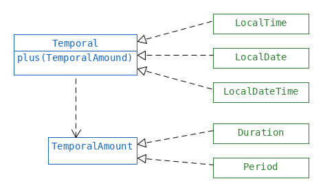

== Time

|===
| System.out.println(LocalDate.now());            |        2015–05–25
| System.out.println(LocalTime.now());            |        09:13:07.768
| System.out.println(LocalDateTime.now());        |        2015–05–25T09:13:07.768
| System.out.println(ZonedDateTime.now());        |        2015–05–25T09:13:07.769–04:00[America/New_York]
|===

[source,java]
LocalDate date1 = LocalDate.of(2015, Month.JANUARY, 20);
LocalDate date2 = LocalDate.of(2015, 1, 20);

[source,java]
LocalTime time1 = LocalTime.of(6, 15);          // hour and minute
LocalTime time2 = LocalTime.of(6, 15, 30);      // + seconds
LocalTime time3 = LocalTime.of(6, 15, 30, 200); // + nanoseconds

[source,java]
public static LocalDateTime of(
    int year,
    Month month, int dayOfMonth,
    int hour, int minute, int second, int nanos)
LocalDateTime dateTime1 = LocalDateTime.of(2015, Month.JANUARY, 20, 6, 15, 30);
//
public static LocalDateTime of(LocalDate date, LocalTime time)
LocalDateTime dateTime2 = LocalDateTime.of(date1, time1);

[source,java]
ZoneId zone = ZoneId.of("US/Eastern");
ZonedDateTime zoned1 = ZonedDateTime.of(2015, 1, 20,6, 15, 30, 200, zone);
ZonedDateTime zoned2 = ZonedDateTime.of(date1, time1, zone);
ZonedDateTime zoned3 = ZonedDateTime.of(dateTime1, zone);

finding a time zone

[source,java]
ZoneId.systemDefault()
ZoneId.getAvailableZoneIds().stream()
    .filter(z -> z.contains("US") || z.contains("America"))
    .sorted().forEach(System.out::println);

* All the constructors of the date/time classes are private.

==== manipulating Dates and Times
* Date and time classes are immutable.
* but there are methods that return a new instance, with desired adjustments.
* this also means these methods can be chained.

[source,java]
LocalDate
    .plusDays(int i);
    .plusWeeks(int i);
    .plusMonths(int i);
    .plusYears(int i);
// same is available with minus
LocalTime
    .plusHours
    .plusMinutes
    .plusSeconds
    .plusNanos

==== Epoch
* 01.01.1970 GMT Unix introduced date standards.
** LocalDate has `long` `toEpochDay()` : days since 01.01.1970
** `LocalDateTime`, `ZoneDateTime` has `long` `toEpochSecond()` : seconds since 01.01.1970

{empty} +

{empty} +

==== Period
* `Period` can store an arbitrary amount of *days*.
* Temporal

[source,java]
Period
    .ofYears(int i)
    .ofMonths(int i)
    .ofWeeks(int i)
    .ofDays(int i)
    .of(int year, int month, int day)
//
Period wrong = Period.ofYears(1).ofWeeks(1); // P7D , reassigns to the new value
//
System.out.printIn(Period.of(1,2,3));   // P1Y2M3D
System.out.println(Period.ofMonths(3)); // P3M
System.out.println(Period.ofWeeks(3));  // P21D
//
LocalDate local = LocalDate.now().plus(Period.ofDays(2)); // OK
LocalTime local = LocalTime.now().plus(Period.ofDays(2)); // UnsupportedTemporalTypeException

{empty} +

==== Duration
* `Duration` (=period of time) can store an arbitrary amount of *time*.
* Doesn't have combined "constructor" like (1,2,3)
* Has a "constructor" for iface `TemporalUnit` which is typically  implemented by `ChronoUnit`.

[source,java]
Duration day = Duration.ofDays(1);      // PT24H
Duration hour = Duration.ofHours(1);    // PT1H
Duration min = Duration.ofMinutes(1);   // PT1M
Duration sec = Duration.ofSeconds(1);   // PT1S
Duration milli = Duration.ofMillis(1);  // PT0.001S
Duration nano = Duration.ofNanos(1);    // PT0.000000001S
//
Duration daily = Duration.of(1, ChronoUnit.DAYS);
Duration hourly = Duration.of(1, ChronoUnit.HOURS);
Duration everyMinute = Duration.of(1, ChronoUnit.MINUTES);
Duration everyTenSeconds = Duration.of(10, ChronoUnit.SECONDS);
Duration everyMilli = Duration.of(1, ChronoUnit.MILLIS);
Duration everyNano = Duration.of(1, ChronoUnit.NANOS);
//
LocalTime local = LocalTime.of(6, 15).plus(Duration.ofHours(23); // 05:15 -> wraps around
LocalDate local = LocalDate.now().plus(Duration.ofHours(2)); // UnsupportedTemporalTypeException
LocalDate local = Localdate.now().plus(Duration.ofDays(1)); // Unsupported unit: Seconds

{empty} +

==== ChronoUnit

[source,java]
LocalTime one = LocalTime.of(5, 15);
LocalTime two = LocalTime.of(6, 30);
LocalDate date = LocalDate.of(2016, 1, 20);
System.out.println(ChronoUnit.HOURS.between(one, two));    // 1
System.out.println(ChronoUnit.MINUTES.between(one, two));  // 75
System.out.println(ChronoUnit.MINUTES.between(one, date)); // DateTimeException

{empty} +

==== Instant

