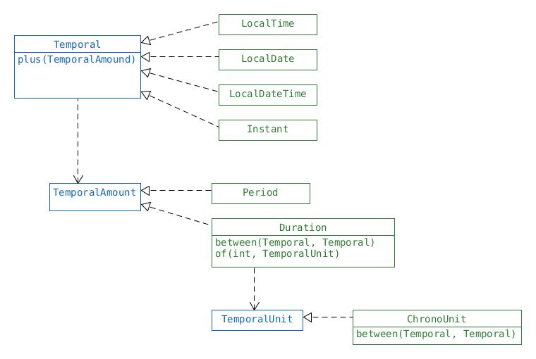

== Time

|===
| System.out.println(LocalDate.now());            |        2015–05–25
| System.out.println(LocalTime.now());            |        09:13:07.768
| System.out.println(LocalDateTime.now());        |        2015–05–25T09:13:07.768
| System.out.println(ZonedDateTime.now());        |        2015–05–25T09:13:07.769–04:00[America/New_York]
|===

[source,java]
LocalDate date1 = LocalDate.of(2015, Month.JANUARY, 20);
LocalDate date2 = LocalDate.of(2015, 1, 20);

[source,java]
LocalTime time1 = LocalTime.of(6, 15);          // hour and minute
LocalTime time2 = LocalTime.of(6, 15, 30);      // + seconds
LocalTime time3 = LocalTime.of(6, 15, 30, 200); // + nanoseconds

[source,java]
public static LocalDateTime of(
    int year,
    Month month, int dayOfMonth,
    int hour, int minute, int second, int nanos)
LocalDateTime dateTime1 = LocalDateTime.of(2015, Month.JANUARY, 20, 6, 15, 30);
//
public static LocalDateTime of(LocalDate date, LocalTime time)
LocalDateTime dateTime2 = LocalDateTime.of(date1, time1);

====== Time Zones

* Time zones are shown as `T<local hour><increment from GMT>`
* We need to reverse it to get from Zoned Time to GMT.
* Thus `2015–05–25T09:10–04:00` means 13:10 in GMT.

[source,java]
ZoneId zone = ZoneId.of("US/Eastern");
ZonedDateTime zoned1 = ZonedDateTime.of(2015, 1, 20,6, 15, 30, 200, zone);
ZonedDateTime zoned2 = ZonedDateTime.of(date1, time1, zone);
ZonedDateTime zoned3 = ZonedDateTime.of(dateTime1, zone);

finding a time zone

[source,java]
ZoneId.systemDefault()
ZoneId.getAvailableZoneIds().stream()
    .filter(z -> z.contains("US") || z.contains("America"))
    .sorted().forEach(System.out::println);

* All the constructors of the date/time classes are private.

==== manipulating Dates and Times
* Date and time classes are immutable.
* but there are methods that return a new instance, with desired adjustments.
* this also means these methods can be chained.

[source,java]
LocalDate
    .plusDays(int i);
    .plusWeeks(int i);
    .plusMonths(int i);
    .plusYears(int i);
// same is available with minus
LocalTime
    .plusHours
    .plusMinutes
    .plusSeconds
    .plusNanos

==== Epoch
* 01.01.1970 GMT Unix introduced date standards.
** LocalDate has `long` `toEpochDay()` : days since 01.01.1970
** `LocalDateTime`, `ZoneDateTime` has `long` `toEpochSecond()` : seconds since 01.01.1970

{empty} +

{empty} +

==== Period
* `Period` can store an arbitrary amount of *days*.
* Temporal

[source,java]
Period
    .ofYears(int i)
    .ofMonths(int i)
    .ofWeeks(int i)
    .ofDays(int i)
    .of(int year, int month, int day)
//
Period wrong = Period.ofYears(1).ofWeeks(1); // P7D , reassigns to the new value
//
System.out.printIn(Period.of(1,2,3));   // P1Y2M3D
System.out.println(Period.ofMonths(3)); // P3M
System.out.println(Period.ofWeeks(3));  // P21D
//
LocalDate local = LocalDate.now().plus(Period.ofDays(2)); // OK
LocalTime local = LocalTime.now().plus(Period.ofDays(2)); // UnsupportedTemporalTypeException

{empty} +

==== Duration
* `Duration` (=period of time) can store an arbitrary amount of *time*.
* Doesn't have combined "constructor" like (1,2,3)
* Has a "constructor" for iface `TemporalUnit` which is typically  implemented by `ChronoUnit`.

[source,java]
Duration day = Duration.ofDays(1);      // PT24H
Duration hour = Duration.ofHours(1);    // PT1H
Duration min = Duration.ofMinutes(1);   // PT1M
Duration sec = Duration.ofSeconds(1);   // PT1S
Duration milli = Duration.ofMillis(1);  // PT0.001S
Duration nano = Duration.ofNanos(1);    // PT0.000000001S
//
Duration daily = Duration.of(1, ChronoUnit.DAYS);
Duration hourly = Duration.of(1, ChronoUnit.HOURS);
Duration everyMinute = Duration.of(1, ChronoUnit.MINUTES);
Duration everyTenSeconds = Duration.of(10, ChronoUnit.SECONDS);
Duration everyMilli = Duration.of(1, ChronoUnit.MILLIS);
Duration everyNano = Duration.of(1, ChronoUnit.NANOS);
//
LocalTime local = LocalTime.of(6, 15).plus(Duration.ofHours(23); // 05:15 -> wraps around
LocalDate local = LocalDate.now().plus(Duration.ofHours(2)); // UnsupportedTemporalTypeException
LocalDate local = Localdate.now().plus(Duration.ofDays(1)); // Unsupported unit: Seconds

{empty} +

====== ChronoUnit

[source,java]
LocalTime one = LocalTime.of(5, 15);
LocalTime two = LocalTime.of(6, 30);
LocalDate date = LocalDate.of(2016, 1, 20);
System.out.println(ChronoUnit.HOURS.between(one, two));    // 1
System.out.println(ChronoUnit.MINUTES.between(one, two));  // 75
System.out.println(ChronoUnit.MINUTES.between(one, date)); // DateTimeException

{empty} +

==== Instant

* Specific moment in time in *the* GMT time zone.
* Implements `Temporal`
* `ZonedDateTime` has an `toInstant(): Instant` method.
* can be created by `Instant.now()`
* can add `ChronoUnit.DAYS` , but can't add `ChronoUnit.WEEKS` -> `R-Exception`

[source,java]
Instant nextHour = instant.plus(1, ChronoUnit.HOURS);
System.out.println(nextHour); // 2015–05–25T16:55:00Z
Instant nextWeek = instant.plus(1, ChronoUnit.WEEKS); // exception

==== Daylight Savings Time
* In Nov clocks go back 1h.
* In March clocks go forward 1h.

[source,java]
Normal
1:59->2:00
March
1:59->3:00
Nov
1:59->1:00

* below zoned time changes by 2h, but GMT changes by 1h

[source,java]
System.out.println(dateTime); // 2016–03–13T01:30–05:00[US/Eastern]
dateTime = dateTime.plusHours(1);
System.out.println(dateTime); // 2016–03–13T03:30–04:00[US/Eastern]

* when trying to create a time that does not exist, java will skip it

[source,java]
LocalDate date = LocalDate.of(2016, Month.MARCH, 13);
LocalTime time = LocalTime.of(2, 30);
ZoneId zone = ZoneId.of("US/Eastern");
ZonedDateTime dateTime = ZonedDateTime.of(date, time, zone);
System.out.println(dateTime); // 2016–03–13T03:30–04:00[US/Eastern]

==== Internationalization (i18n) & Localization (l10n)
* i18n : designing program so locales can be added easily
* l10n : supporting multiple locales (lang/country pair)
* locales have two formats, other variations are invalid
** lang only : `fr`
** lang + country : `en_US`
* Java allows creating invalid locales, but it will not match -> bug
* There is a builder for locales

[source,java]
Locale locale = Locale.getDefault();
System.out.println(Locale.GERMAN);           // de
System.out.println(Locale.GERMANY);          // de_DE
ystem.out.println(new Locale("fr"));         // fr
System.out.println(new Locale("hi", "IN"));  // hi_IN
Locale l1 = new Locale.Builder().setLanguage("en").setRegion("US").build();
Locale.setDefault(new Locale("fr")); // changes locale for current program

==== Resource Bundle
* Contains local specific objects
** can be a property file or a java class
* See java example and Hello_en.properties7
* `Properties`
** similar to `Map`, but older, behaves slightly different
* .property files are limited to String
** Custom ResourceBundles can contain Objects, see .java example
*** it uses ListResourceBundle which extends ResourceBundle
* getting a Resource Bundle

[%header]
|===
2+| resolution order when trying to resolve a `ResourceBundle`  with  param `Hello`, `fr_FR` +
with default locale being `en_EN` .
2+| `.java` before `.properties`
| `Hello_fr_FR` | requested locale
| `Hello_fr` | requested language
| `Hello_en_US` | default locale
| Hello_en | default language
| Hello | no locale
2+| `MissingResourceException`
2+| When param is only `Hello`, `fr` - then  looking for `Hello_fr_FR` and `Hello_en_US` is skipped.

|===

{empty} +

==== DateTimeFormatter
[source,java]
DateTimeFormatter shortDateTime = DateTimeFormatter.ofLocalizedDate(FormatStyle.SHORT);
shortDateTime.format(date); //
date.format(shortDateTime); // equivalent command

[%header]
|===
| DateTimeFormatter +
.ofLocalized.. | Temporal to be formatted | Outcome
| Date | (Zoned-)DateTime |
| Date | Time | Exception
| (Zoned-)DateTime | Date | Exception
| (Zoned-)DateTime | Time | Exception
| Time | Date | Exception
| Time | (Zoned-)DateTime |

|===

DateTimeFormatter f = DateTimeFormatter.ofPattern("MMMM dd, yyyy, hh:mm");
System.out.println(dateTime.format(f));

// January 20, 2020, 11:12

Before we look at the syntax, know that you are not expected to memorize what the dif-
ferent numbers of each symbol mean. The most you will need to do is to recognize the date
and time parts. +
M represents the month. The more M s you have, the more verbose the Java output. For
example, M outputs 1, MM outputs 01, MMM outputs Jan, and MMMM outputs January.
MMMM +
dd d represents the day in the month. As with month , the more d s you have, the more ver-
bose the Java output. dd means to include the leading zero for a single-digit day.
,
Use , if you want to output a comma (this also appears after the year).
yyyy
y represents the year. yy outputs a two-digit year and yyyy outputs a four-digit year.
hh h represents the hour. Use hh to include the leading zero if you’re outputting a single-digit hour.
:
Use : if you want to output a colon.
m represents the minute omitting the leading zero if present. mm is more common and
represents the minutes using two digits.

hh 01-12 (AM/PM )
HH 00-23
kk 01-24

[source,java]
// old way
SimpleDateFormat sf = new SimpleDateFormat("hh:mm");
sf.format(jan3);
// new way
DateTimeFormatter f = DateTimeFormatter.ofPattern("hh:mm");
dt.format(f);

[source,java]
DateTimeFormatter f = DateTimeFormatter.ofPattern("MM dd yyyy");
LocalDate date = LocalDate.parse("01 02 2015", f);
LocalTime time = LocalTime.parse("11:22");
System.out.println(date); // 2015–01–02
System.out.println(time); // 11:22
