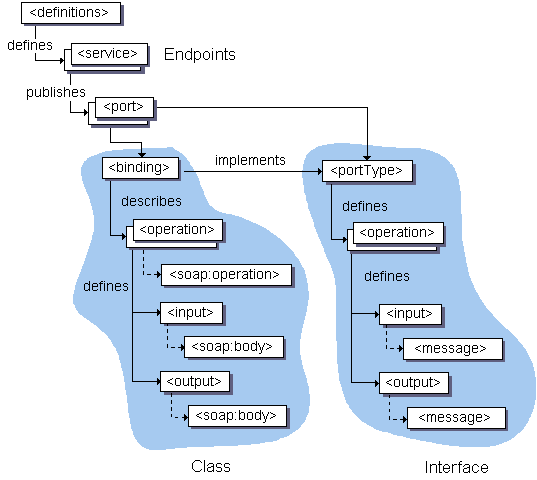

== WSDL
Web Services Description Language

* XML
* Describes a Web Service
* often used in combination with SOAP and XML Schema to provide web services over the Internet.
** The client can then use SOAP to actually call one of the functions listed in the WSDL

{empty} +

=== Elements
* Types
* Operations
* Binding

==== JAXB
* is not included in the default jdk anymore
* use --add-modules java.xml.bind option

=== Web Service
=== RPC (Remote Process Call)
* RMI (remote method invocation)
* Stup/Skeleton hide the network call
** Skeleton : code on the server providing the webservice
** Stub : proxy / adapter on the client

{empty} +
{empty} +

==== Generate Stubs from .wsdl
* command : `mvn cxf-codegen:wsdl2java`
* use java 1.8 otherwise error.

==== XML namespaces
* see https://www.w3schools.com/XML/xml_namespaces.asp
** namespace is defined at start of doc with `xmlns:<foo>`
** URI is just used as distinction (not for lookup)

==== WSDL Document

[cols="1,5"]
|===
| `definitions` |
Contains the definition of 1..n services: +
> `name` : optional. +
> `targetNamespace` : logical namespace for information about this service. +
WSDL documents can import other WSDL documents, and setting targetNamespace to a unique value ensures that the namespaces do not clash. +
> `xmlns` is the default namespace of the WSDL document, and it is set to http://schemas.xmlsoap.org/wsdl/. +
All the WSDL elements, such as <definitions>, <types> and <message> reside in this namespace. +
> `xmlns:xsd` and `xmlns:soap` are standard namespace definitions that are used for specifying SOAP-specific information as well as data types. +
> `xmlns:tns` stands for this namespace. +
> `xmlns:ns1` is set to the value of the `schema targetNamespace`, in the `<types>` section. +
|===

[cols="1,5"]
|===
| `types` |Provides information about any complex data types used in the WSDL document. +
When simple types are used the document does not need to have a types section. +
WSDL supports the XML Schemas specification (XSD) as its type system.
| `message` | definition of the data being communicated. +
In the example, the message contains just one part, response, which is of type string, where string is defined by the XML Schema.
| `operation` | An abstract description of the action supported by the service.
| `portType` | set of operations, supported by 1..n endpoints.
| `binding` | describes protocol and data format for  operations & messages.
| `port` | specifies a single endpoint as an address for the binding.
| `service` | collection of ports.